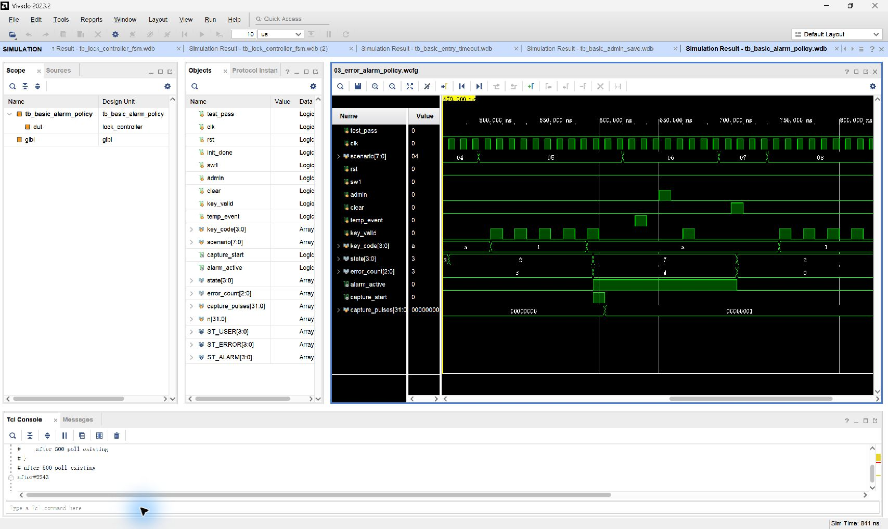
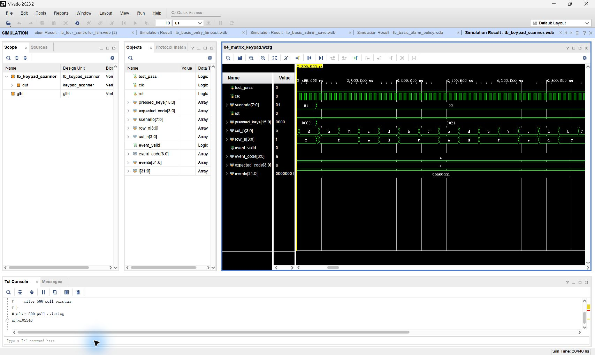
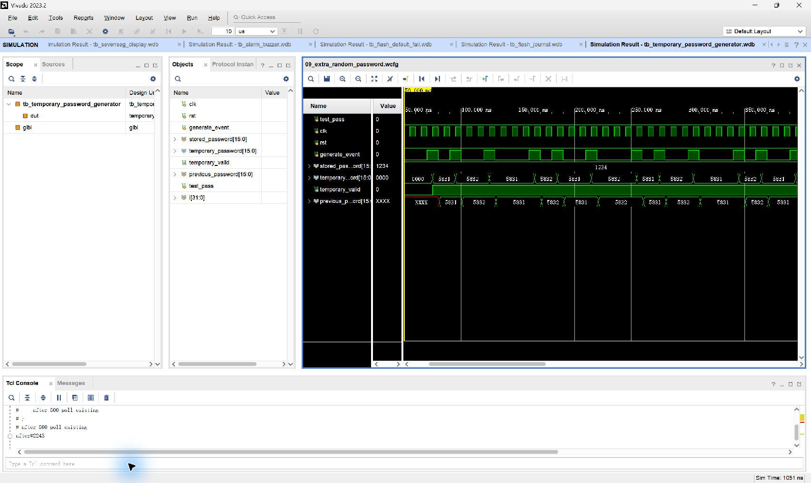
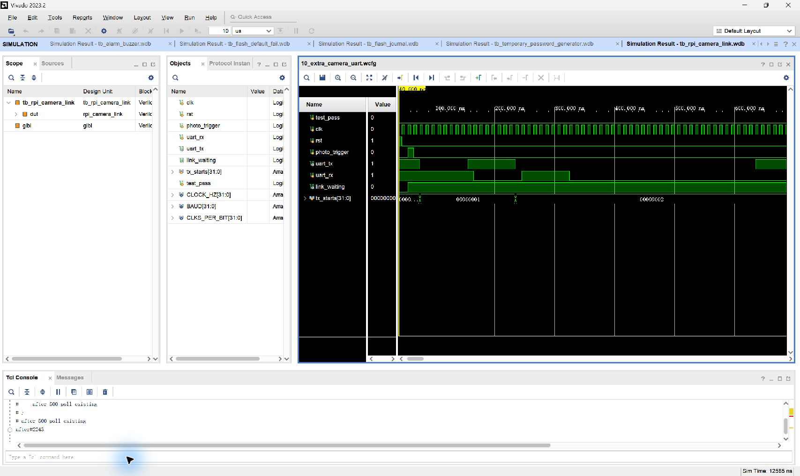

# FPGA 密码锁 Vivado 仿真波形总览

## 结论

2026-09-13 使用 Vivado 2023.2 XSim 对最终 RTL 运行 11 组行为级仿真，结果为 **11/11 PASS**。覆盖题目要求的基础密码锁功能，以及两项附加功能：KEY3 四位随机临时密码、FPGA 触发 Raspberry Pi 5 报警拍摄。

每个编号目录都包含：

- `.wdb`：Vivado 原生波形数据库，可在 Vivado 中缩放和查看所有已记录信号；
- `.wcfg`：Vivado 波形窗口配置；
- `.vcd`：标准波形交换文件；
- `.png`：从对应 WDB/WCFG 在 Vivado 原生波形窗口截取的黑底绿色波形图，保留 `Name`、`Value`、完整时间轴与黄色游标；
- `.log`：完整编译、展开、仿真日志；
- `result.txt`：机器可读的 PASS 结果。
- `README.md`：该场景的端口跳变、时钟采样、输出变化和实际功能说明。

## 编号与覆盖关系

| 编号 | Testbench | 覆盖功能 | 结果 | 产物 |
|---:|---|---|:---:|---|
| 01 | `tb_basic_entry_timeout` | Flash 初始化进入 `PASS`；不足四位确认无效；退格；最多四位；固定密码 `1234`；16 秒自动上锁；8 秒输入超时；`A` 立即上锁 | PASS | [PNG](01_basic_entry_timeout/tb_basic_entry_timeout.png) · [WDB](01_basic_entry_timeout/tb_basic_entry_timeout.wdb) · [VCD](01_basic_entry_timeout/tb_basic_entry_timeout.vcd) · [日志](01_basic_entry_timeout/tb_basic_entry_timeout.log) |
| 02 | `tb_basic_admin_save` | KEY1 进入 `SEt`；新密码提交；Flash 保存成功返回 `PASS`；失败显示 `FErr` 且不启用坏记录；新操作清除错误显示；管理员输入超时 | PASS | [PNG](02_admin_password_save/tb_basic_admin_save.png) · [WDB](02_admin_password_save/tb_basic_admin_save.wdb) · [VCD](02_admin_password_save/tb_basic_admin_save.vcd) · [日志](02_admin_password_save/tb_basic_admin_save.log) |
| 03 | `tb_basic_alarm_policy` | `Err1/Err2/Err3`；第 4 次错误进入 `ALAr`；单周期拍摄触发；KEY1/KEY3/矩阵键盘不能解除；仅 KEY2 解除；错误计数从 0 重新开始 | PASS | [PNG](03_error_alarm_policy/tb_basic_alarm_policy.png) · [WDB](03_error_alarm_policy/tb_basic_alarm_policy.wdb) · [VCD](03_error_alarm_policy/tb_basic_alarm_policy.vcd) · [日志](03_error_alarm_policy/tb_basic_alarm_policy.log) |
| 04 | `tb_keypad_scanner` | 四列轮询；16 键完整映射；按下/释放消抖；长按只产生一次事件；多键同时按下全部忽略 | PASS | [PNG](04_matrix_keypad/tb_keypad_scanner.png) · [WDB](04_matrix_keypad/tb_keypad_scanner.wdb) · [VCD](04_matrix_keypad/tb_keypad_scanner.vcd) · [日志](04_matrix_keypad/tb_keypad_scanner.log) |
| 05 | `tb_sevenseg_display` | 共阳低有效动态扫描；`INIT/PASS/ErrN/OPEN/SEt/SAVE/ALAr/tEMP/FErr` 全部状态；输入数字和临时密码显示 | PASS | [PNG](05_seven_segment/tb_sevenseg_display.png) · [WDB](05_seven_segment/tb_sevenseg_display.wdb) · [VCD](05_seven_segment/tb_sevenseg_display.vcd) · [日志](05_seven_segment/tb_sevenseg_display.log) |
| 06 | `tb_alarm_buzzer` | 高电平使能蜂鸣器载波、间歇节拍、报警 LED 同步、解除后立即静音 | PASS | [PNG](06_alarm_buzzer/tb_alarm_buzzer.png) · [WDB](06_alarm_buzzer/tb_alarm_buzzer.wdb) · [VCD](06_alarm_buzzer/tb_alarm_buzzer.vcd) · [日志](06_alarm_buzzer/tb_alarm_buzzer.log) |
| 07 | `tb_flash_default_fail` | 空/不可读 Flash 使用默认密码 `1234`；写入失败后继续使用旧密码并报告故障 | PASS | [PNG](07_flash_default_failure/tb_flash_default_fail.png) · [WDB](07_flash_default_failure/tb_flash_default_fail.wdb) · [VCD](07_flash_default_failure/tb_flash_default_fail.vcd) · [日志](07_flash_default_failure/tb_flash_default_fail.log) |
| 08 | `tb_flash_journal` | 双扇区记录；保存及回读；代际版本选择；单份记录损坏后恢复另一份有效记录；CRC/提交有效性 | PASS | [PNG](08_flash_dual_journal/tb_flash_journal.png) · [WDB](08_flash_dual_journal/tb_flash_journal.wdb) · [VCD](08_flash_dual_journal/tb_flash_journal.vcd) · [日志](08_flash_dual_journal/tb_flash_journal.log) |
| 09 | `tb_temporary_password_generator` | 附加功能一：LFSR 采样生成四位十进制临时密码；避开固定密码；连续生成不重复；复位失效 | PASS | [PNG](09_extra_random_password/tb_temporary_password_generator.png) · [WDB](09_extra_random_password/tb_temporary_password_generator.wdb) · [VCD](09_extra_random_password/tb_temporary_password_generator.vcd) · [日志](09_extra_random_password/tb_temporary_password_generator.log) |
| 10 | `tb_rpi_camera_link` | 附加功能二：报警脉冲锁存；UART 发送 `ALARM\n`；接收 `ACK\n`；确认后清除等待；未确认自动重发 | PASS | [PNG](10_extra_camera_uart/tb_rpi_camera_link.png) · [WDB](10_extra_camera_uart/tb_rpi_camera_link.wdb) · [VCD](10_extra_camera_uart/tb_rpi_camera_link.vcd) · [日志](10_extra_camera_uart/tb_rpi_camera_link.log) |
| 11 | `tb_lock_controller` | 固定密码、随机临时密码、替换后旧临时密码失效、管理员改密、四次错误报警与解除的集成回归 | PASS | [PNG](11_integrated_controller_regression/tb_lock_controller.png) · [WDB](11_integrated_controller_regression/tb_lock_controller.wdb) · [VCD](11_integrated_controller_regression/tb_lock_controller.vcd) · [日志](11_integrated_controller_regression/tb_lock_controller.log) |

## 波形判读说明

控制器波形中的 `state` 数值含义为：`0=BOOT`、`1=WAIT/PASS`、`2=USER`、`3=ERROR`、`4=OPEN`、`5=ADMIN/SET`、`6=SAVE`、`7=ALARM`、`8=TEMP`。编号 01～03 中的 `scenario` 是 testbench 阶段标记，用来分隔各个验收步骤；编号 04 的 `scenario=0x10～0x1F` 对应依次验证 16 个键位。

同步输入通常由 testbench 在 `clk` 下降沿附近准备，保持到下一上升沿被 DUT 采样。因此阅读波形时，应先找输入端口的 `0→1`，再沿时间轴定位紧随其后的时钟上升沿，最后观察 `state`、计数器或输出端口的变化。各目录的 `README.md` 已按此顺序解释关键事件。总线交叉处表示数值改变，单根高低电平线分别表示逻辑 `1/0`。

为缩短仿真时间，控制器测试把 `CLOCK_HZ` 和计时参数按相同比例缩小。例如编号 01 的 1000 个仿真时钟周期代表实机 8 秒输入超时边界，2000 个周期代表实机 16 秒开锁超时边界；状态机使用的参数和比较逻辑与实机一致。

编号 10 验证的是 FPGA 侧拍摄接口。树莓派侧的 CSI 拍摄、四张 JPEG 原子保存、`640×480` 四宫格生成、HDMI 全屏替换及解除报警后画面保留由 Python 单元测试与 2026-09-08 实机联调验证，不属于 Vivado 可仿真的硬件逻辑。

## 关键波形预览

### 03 四次错误与报警策略



### 04 矩阵键盘完整映射



### 09 随机临时密码



### 10 报警拍摄 UART



## 在 Vivado 中打开原生波形

在 Vivado Tcl Console 中使用对应文件的绝对路径：

```tcl
open_wave_database E:/26FPGA/simulation_waveforms/10_extra_camera_uart/tb_rpi_camera_link.wdb
open_wave_config E:/26FPGA/simulation_waveforms/10_extra_camera_uart/tb_rpi_camera_link.wcfg
```

也可直接在 Vivado 的波形窗口打开 `.wdb`，再载入同目录 `.wcfg`。克隆仓库到其他位置后，把命令中的根目录替换为实际路径。

## 一键复现

在仓库根目录执行：

```powershell
.\password_lock_system\scripts\generate_waveforms.ps1
```

脚本会为每个 testbench 建立独立的临时 Vivado 工程，避免污染正式 `.xpr`；随后运行 XSim、检查 `test_pass`，并导出 WDB/VCD/WCFG/日志。

在带桌面的 Windows 环境中，运行以下命令可从 WDB/WCFG 重新截取 11 张 Vivado 原生波形图：

```powershell
.\password_lock_system\scripts\capture_vivado_waveforms.ps1
```

截图脚本使用 DPI 感知的物理像素坐标，默认保留 Vivado 波形区域右侧至窗口边界，避免遗漏仿真终点。若屏幕分辨率或 Vivado 布局不同，可通过 `CropLeft/CropTop/CropWidth/CropHeight` 参数调整。

## 验证边界

- 本报告中的 PASS 是自动断言结果，不以肉眼波形判断代替测试。
- 基础密码锁和树莓派报警拍摄链路已完成实机验证；KEY3 随机临时密码在本报告中完成 RTL 与集成仿真，尚未追加实机按键验收记录。
- 抓拍产生的真实人物/环境照片没有提交到 GitHub；仓库只保存协议波形、测试代码和不含隐私的验证说明。
## 12. Lock Controller 主状态机分段仿真（新增）

专用目录：[`12_lock_controller_fsm`](12_lock_controller_fsm/README.md)。包含 38 张 Vivado 2023.2 原生 Wave 截图和逐图说明，覆盖 9 个状态、全部 17 条合法非自环业务转移、所有状态同步复位、非法状态恢复、超时边界、保存握手、报警及事件优先级。图片没有重画；每份说明明确记录输入端口 0→1/1→0、随后时钟上升沿和输出效果。
