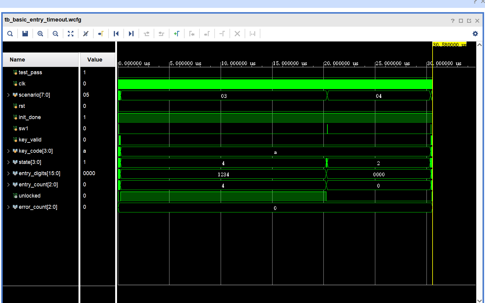

# 01 基础输入、开锁与超时

## 波形判读

- `rst` 从 `1→0` 释放复位，`init_done` 从 `0→1` 表示 Flash 密码初始化完成；下一个 `clk` 上升沿后，`state` 进入 `1 (WAIT/PASS)`。
- `sw1` 的 `0→1→0` 单周期脉冲在时钟上升沿被采样，控制器进入 `2 (USER)`。每次 `key_valid` 从 `0→1` 时，`key_code` 在对应上升沿写入，`entry_digits` 左移追加一位，`entry_count` 加一；`B` 触发退格，`A` 触发确认。
- 输入 `1234` 后确认，下一上升沿使 `state: 2→4`、`unlocked: 0→1`；开锁计时结束或再次按 `A` 时，`state: 4→1`、`unlocked: 1→0`。
- 输入状态长期无按键时，超时计数在时钟上升沿累加，达到边界后自动返回 `WAIT` 并清空输入。

## 实际功能

验证不足四位不能确认、退格、最多四位、固定密码开锁、16 秒自动上锁、8 秒输入超时和 `A` 键立即上锁。仿真按比例缩短了计时周期，状态机比较逻辑与实机一致。
