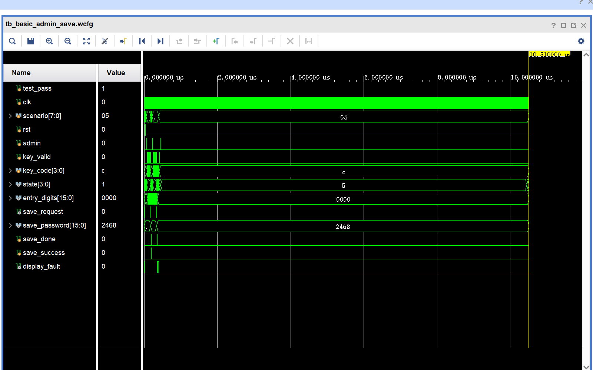

# 02 管理员改密与保存

## 波形判读

- `admin` 的 `0→1→0` 脉冲在 `clk` 上升沿被采样后，`state: 1→5 (ADMIN/SET)`。
- 四次 `key_valid: 0→1` 依次装入新密码；确认键 `A` 被采样后，`state: 5→6 (SAVE)`、`save_request: 0→1`，同时 `save_password` 保持待写入的四位密码。
- 成功场景中，`save_done: 0→1` 与 `save_success=1` 在上升沿被采样，状态返回 `WAIT`；失败场景中 `save_success=0`，返回后 `display_fault: 0→1`，下一次新操作再清零。
- 管理员界面无输入达到超时边界后，状态在上升沿回到 `WAIT`。

## 实际功能

验证 KEY1 管理员改密、Flash 写请求、成功启用新密码、写失败保留旧密码并显示 `FErr`，以及管理员输入超时退出。
