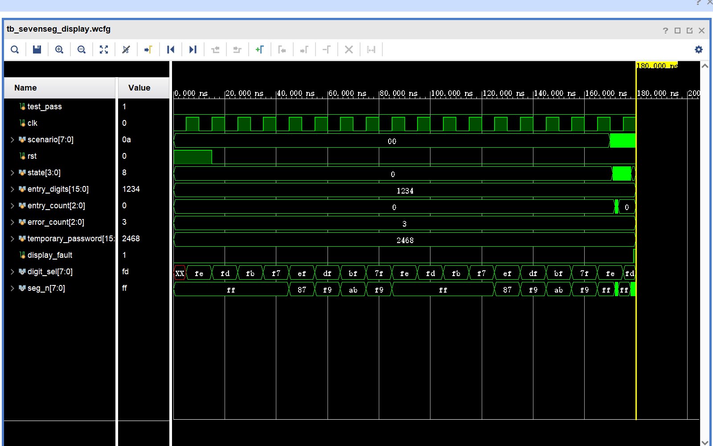

# 05 八位数码管显示

## 波形判读

- `digit_sel` 为低有效位选，每个扫描节拍在 `clk` 上升沿切换一个低电平位；任意时刻只有一位为 `0`。
- `seg_n` 同样低有效，并随当前位和字符组合变化。观察 `digit_sel` 的选通位与同一时刻的 `seg_n` 可还原该位字形。
- `state` 变化后组合字符表更新：`0~8` 分别对应 `INIT/PASS/输入/ErrN/OPEN/SEt/SAVE/ALAr/tEMP`；`display_fault: 0→1` 时覆盖显示 `FErr`。
- 输入态的 `entry_digits` 和临时密码态的 `temporary_password` 分别显示四位数字。

## 实际功能

验证共阳、低有效动态扫描，所有状态提示字形、输入数字、临时密码及 Flash 故障提示。
