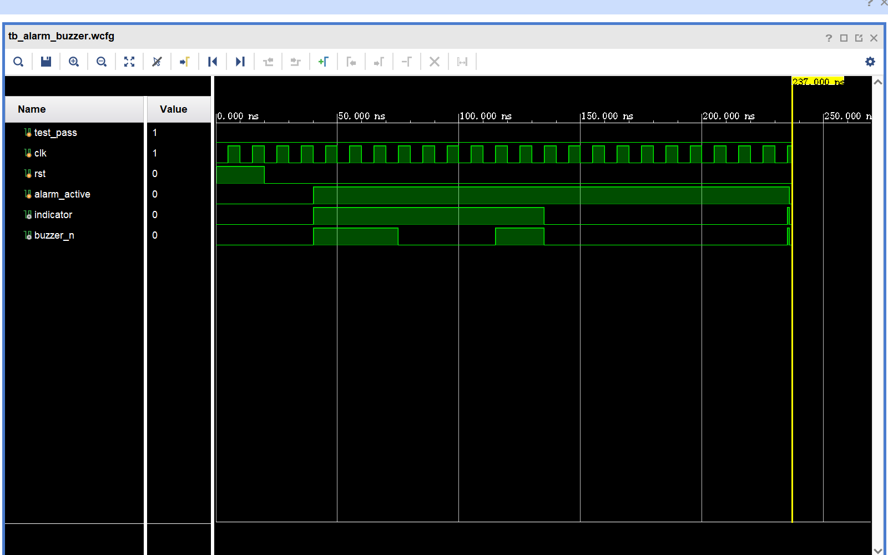

# 06 报警蜂鸣器与指示灯

## 波形判读

- `rst: 1→0` 后保持安全静音，`buzzer_n=0`、`indicator=0`。
- `alarm_active: 0→1` 后，计数器从后续 `clk` 上升沿开始推进；可听阶段 `indicator=1`，`buzzer_n` 按音调频率翻转形成载波。
- 节拍进入静音阶段时，`indicator: 1→0` 且 `buzzer_n→0`；下一可听阶段再次重复载波。
- `alarm_active: 1→0` 时组合门控立即把两个输出清零，不必等待节拍结束。

## 实际功能

验证间歇报警节拍、可听阶段蜂鸣载波、LED 同步指示和解除报警后立即静音。
