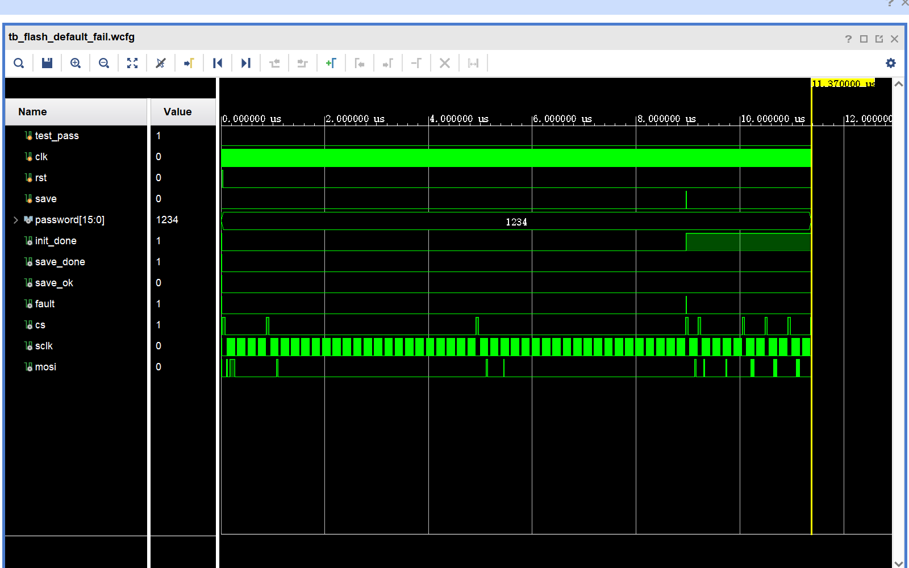

# 07 Flash 空记录与写失败保护

## 波形判读

- `rst: 1→0` 后控制器在 `clk` 上升沿启动 SPI 初始化；`cs: 1→0` 选中 Flash，`sclk` 翻转时由 `mosi/miso` 传输命令和数据。
- 模型把 `miso` 固定为 `1`，模拟空白或不可读记录；初始化完成时 `init_done: 0→1`，`password` 采用默认值 `1234`。
- `save: 0→1→0` 被上升沿采样后启动写入。回读校验失败时 `save_done: 0→1`、`save_ok=0`、`fault: 0→1`，而 `password` 保持 `1234` 不变。

## 实际功能

验证 Flash 无有效记录时可用默认密码启动，以及写入失败不会把未验证的新密码激活。
