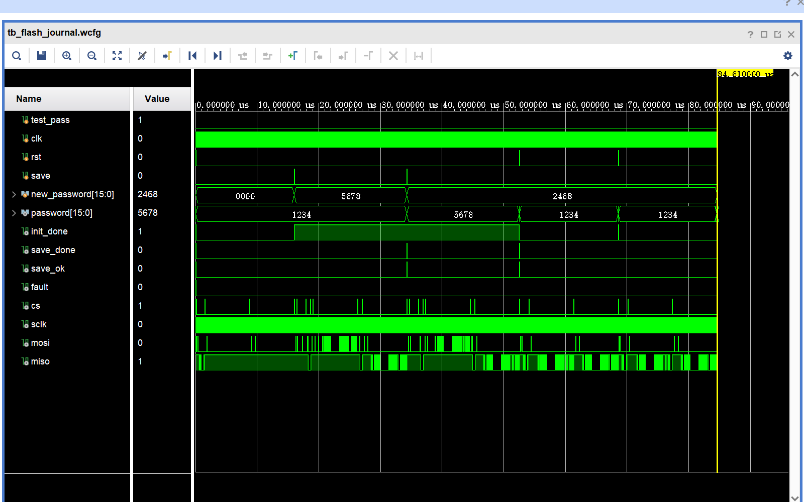

# 08 Flash 双扇区日志

## 波形判读

- `save: 0→1→0` 在 `clk` 上升沿触发保存；`new_password` 在事务期间保持稳定。`cs` 拉低后，`sclk` 驱动 `mosi/miso` 完成擦除、编程和回读。
- 每次校验成功时，`save_done: 0→1` 与 `save_ok=1` 指示提交完成，`password` 才切换为新值；两个保存事务分别写入交替扇区。
- 复位 `rst: 0→1→0` 模拟重启。初始化扫描两个扇区后，`init_done: 0→1`，先选择代际版本较新的 `2468`。
- 人为破坏最新记录的提交标记后再次重启，CRC/提交检查排除坏记录，`password` 回退为另一扇区仍有效的 `5678`。

## 实际功能

验证双扇区冗余、版本选择、保存后回读校验、片选高电平间隔，以及单份记录损坏后的恢复能力。
