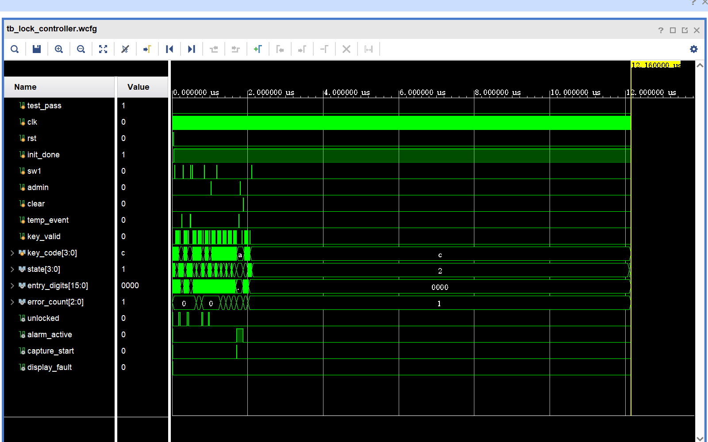

# 11 控制器集成回归

## 波形判读

- 所有按键事件均以 `0→1→0` 脉冲给出，并在 `clk` 上升沿被状态机采样；`key_valid` 有效时，`key_code` 同步提供数字或控制键。
- 固定密码或当前临时密码确认成功后，`state→4`、`unlocked: 0→1`；按 `A` 后 `unlocked: 1→0`。临时密码被替换后，旧值确认使 `state→3 (ERROR)`，新值仍可开锁。
- 管理员提交 `5678` 后，`state→6 (SAVE)`；`save_done/save_success` 被采样后返回等待，随后新固定密码生效。
- 四次错误使 `error_count: 0→4`、`alarm_active: 0→1`、`capture_start` 拉高一个周期。`temp_event`、`admin` 和键盘不能旁路报警，只有 `clear: 0→1` 使报警清零并开始新输入会话。

## 实际功能

在同一个控制器实例中联合验证固定密码、临时密码替换、管理员改密、错误累计、报警拍照触发、KEY2 专用解除和输入超时。
