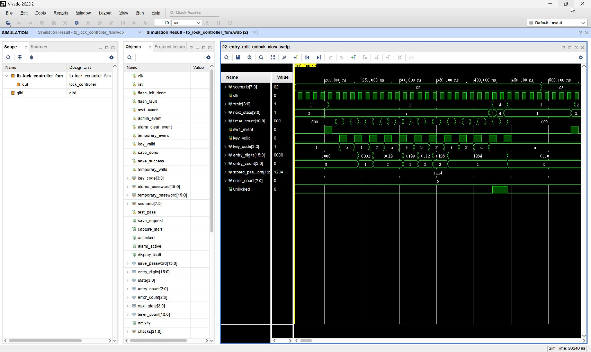

# 02_entry_edit_unlock_close：输入编辑、永久密码开锁与 A 主动关锁

窗口：**160–490 ns**，连续绝对时间；scenario=2。

## 原生 Vivado 截屏



这是 Vivado 2023.2 的 Wave 面板实际截图，未重绘波形。左侧 Name/Value 列的 Value 是黄色游标位置的瞬时值，不一定是事件发生时的值；请按图中横向时间轴和下表判读。state 编码：0 BOOT、1 WAIT、2 USER、3 ERROR、4 OPEN、5 ADMIN、6 SAVE、7 ALARM、8 TEMP。密码和 key_code 为十六进制 BCD。

## 前置条件

WAIT，stored_password=1234。

## 当前激励与状态变化

SW1→USER；空输入按 B 无效。输入 1、2 后按 A，因不足四位留在 USER。追加 9、B 得到 0012，再追加 3、4；第五位 8 和 D 不改变 1234。A 确认使 USER→OPEN，unlocked=1；再按 A 使 OPEN→WAIT，输入缓存清空。

所有事件输入都由测试平台产生一个 10 ns 周期的脉冲。key_valid=1 时 key_code 才是当前新按键；key_valid=0 时保留的 key_code 不是重复激励。next_state 是组合判断，state 在下一上升沿更新；采样后 save_request/capture_start 高一个完整周期。

## 实际端口跳变、采样沿与效果

下表由这次 XSim 的 VCD 数据逐拍反查；`T` ns 的测试平台激励一般在 `clk` 下降沿改变，下一次 `clk` 上升沿在 `T+5` ns 采样。状态/输出用采样后的值，不把 `key_valid` 释放沿误认为第二次按键。表中明确用 0→1 和 1→0 表示端口边沿；若放大窗口中没有新输入边沿，则写明由前序激励或自然计时触发。

| 激励时刻/ns | 输入端口变化 | clk 上升沿/ns | 状态、输出端口实际效果 / 功能 |
| --- | --- | --- | --- |
| 200 | `sw1_event 0→1` | 205 | `state 1:WAIT/PASS→2:USER` |
| 210 | `sw1_event 1→0` | 215 | `state=2:USER` 保持 |
| 220 | `key_valid 0→1`, `key_code 1→B` | 225 | `state=2:USER` 保持, 有效键码 `B` |
| 230 | `key_valid 1→0` | 235 | `state=2:USER` 保持, 按键有效位释放，不重复提交 |
| 240 | `key_valid 0→1`, `key_code B→1` | 245 | `state=2:USER` 保持, `entry_digits 0000→0001`, `entry_count 0→1`, 有效键码 `1` |
| 250 | `key_valid 1→0` | 255 | `state=2:USER` 保持, 按键有效位释放，不重复提交 |
| 260 | `key_valid 0→1`, `key_code 1→2` | 265 | `state=2:USER` 保持, `entry_digits 0001→0012`, `entry_count 1→2`, 有效键码 `2` |
| 270 | `key_valid 1→0` | 275 | `state=2:USER` 保持, 按键有效位释放，不重复提交 |
| 280 | `key_valid 0→1`, `key_code 2→A` | 285 | `state=2:USER` 保持, 有效键码 `A` |
| 290 | `key_valid 1→0` | 295 | `state=2:USER` 保持, 按键有效位释放，不重复提交 |
| 300 | `key_valid 0→1`, `key_code A→9` | 305 | `state=2:USER` 保持, `entry_digits 0012→0129`, `entry_count 2→3`, 有效键码 `9` |
| 310 | `key_valid 1→0` | 315 | `state=2:USER` 保持, 按键有效位释放，不重复提交 |
| 320 | `key_valid 0→1`, `key_code 9→B` | 325 | `state=2:USER` 保持, `entry_digits 0129→0012`, `entry_count 3→2`, 有效键码 `B` |
| 330 | `key_valid 1→0` | 335 | `state=2:USER` 保持, 按键有效位释放，不重复提交 |
| 340 | `key_valid 0→1`, `key_code B→3` | 345 | `state=2:USER` 保持, `entry_digits 0012→0123`, `entry_count 2→3`, 有效键码 `3` |
| 350 | `key_valid 1→0` | 355 | `state=2:USER` 保持, 按键有效位释放，不重复提交 |
| 360 | `key_valid 0→1`, `key_code 3→4` | 365 | `state=2:USER` 保持, `entry_digits 0123→1234`, `entry_count 3→4`, 有效键码 `4` |
| 370 | `key_valid 1→0` | 375 | `state=2:USER` 保持, 按键有效位释放，不重复提交 |
| 380 | `key_valid 0→1`, `key_code 4→8` | 385 | `state=2:USER` 保持, 有效键码 `8` |
| 390 | `key_valid 1→0` | 395 | `state=2:USER` 保持, 按键有效位释放，不重复提交 |
| 400 | `key_valid 0→1`, `key_code 8→D` | 405 | `state=2:USER` 保持, 有效键码 `D` |
| 410 | `key_valid 1→0` | 415 | `state=2:USER` 保持, 按键有效位释放，不重复提交 |
| 420 | `key_valid 0→1`, `key_code D→A` | 425 | `state 2:USER→4:OPEN`, `unlocked 0→1`, 有效键码 `A` |
| 430 | `key_valid 1→0` | 435 | `state=4:OPEN` 保持, 按键有效位释放，不重复提交 |
| 440 | `key_valid 0→1` | 445 | `state 4:OPEN→1:WAIT/PASS`, `entry_digits 1234→0000`, `entry_count 4→0`, `unlocked 1→0`, 有效键码 `A` |
| 450 | `key_valid 1→0` | 455 | `state=1:WAIT/PASS` 保持, 按键有效位释放，不重复提交 |

窗口起点：`rst=0`, `flash_init_done=1`, `sw1_event=0`, `admin_event=0`, `alarm_clear_event=0`, `temporary_event=0`, `key_valid=0`, `key_code=1`, `save_done=0`, `save_success=0`, `stored_password=1234`, `temporary_password=0000`, `temporary_valid=0`, `flash_fault=0`。

## 对应实际功能

SW1→USER；空输入按 B 无效。输入 1、2 后按 A，因不足四位留在 USER。追加 9、B 得到 0012，再追加 3、4；第五位 8 和 D 不改变 1234。A 确认使 USER→OPEN，unlocked=1；再按 A 使 OPEN→WAIT，输入缓存清空。

## 再次打开与分段截屏

配置：[WCFG](../configs/02_entry_edit_unlock_close.wcfg)，完整数据：[WDB](../tb_lock_controller_fsm.wdb)、[VCD](../tb_lock_controller_fsm.vcd)。

在 Vivado Tcl Console 执行（将路径替换为本地仓库路径）：

```tcl
open_wave_database -noautoloadwcfg E:/26FPGA/simulation_waveforms/12_lock_controller_fsm/tb_lock_controller_fsm.wdb
open_wave_config E:/26FPGA/simulation_waveforms/12_lock_controller_fsm/configs/02_entry_edit_unlock_close.wcfg
# 时间窗口已内嵌在 WCFG；打开配置即恢复对应分段。
```
