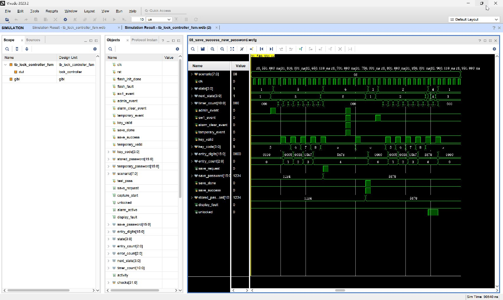

# 08_save_success_new_password：保存成功握手与新永久密码验证

窗口：**31540–31960 ns**，连续绝对时间；scenario=8。

## 原生 Vivado 截屏



这是 Vivado 2023.2 的 Wave 面板实际截图，未重绘波形。左侧 Name/Value 列的 Value 是黄色游标位置的瞬时值，不一定是事件发生时的值；请按图中横向时间轴和下表判读。state 编码：0 BOOT、1 WAIT、2 USER、3 ERROR、4 OPEN、5 ADMIN、6 SAVE、7 ALARM、8 TEMP。密码和 key_code 为十六进制 BCD。

## 前置条件

WAIT，stored_password=1234。Flash 用显式握手激励代替真实 SPI 存储。

## 当前激励与状态变化

KEY1 输入 5678+A，ADMIN→SAVE；save_request 只高一拍，save_password 锁存 5678。在 SAVE 中送所有其他事件及 C 均无效，不重发请求。save_done=1/save_success=1 的上升沿 SAVE→WAIT，无故障；模拟 Flash 同时将 stored_password 更新为 5678。随后 SW1 输入 5678+A 能开锁，再 A 关闭。

所有事件输入都由测试平台产生一个 10 ns 周期的脉冲。key_valid=1 时 key_code 才是当前新按键；key_valid=0 时保留的 key_code 不是重复激励。next_state 是组合判断，state 在下一上升沿更新；采样后 save_request/capture_start 高一个完整周期。

## 实际端口跳变、采样沿与效果

下表由这次 XSim 的 VCD 数据逐拍反查；`T` ns 的测试平台激励一般在 `clk` 下降沿改变，下一次 `clk` 上升沿在 `T+5` ns 采样。状态/输出用采样后的值，不把 `key_valid` 释放沿误认为第二次按键。表中明确用 0→1 和 1→0 表示端口边沿；若放大窗口中没有新输入边沿，则写明由前序激励或自然计时触发。

| 激励时刻/ns | 输入端口变化 | clk 上升沿/ns | 状态、输出端口实际效果 / 功能 |
| --- | --- | --- | --- |
| 31580 | `admin_event 0→1` | 31585 | `state 1:WAIT/PASS→5:ADMIN/SET` |
| 31590 | `admin_event 1→0` | 31595 | `state=5:ADMIN/SET` 保持 |
| 31600 | `key_valid 0→1` | 31605 | `state=5:ADMIN/SET` 保持, `entry_digits 0000→0005`, `entry_count 0→1`, 有效键码 `5` |
| 31610 | `key_valid 1→0` | 31615 | `state=5:ADMIN/SET` 保持, 按键有效位释放，不重复提交 |
| 31620 | `key_valid 0→1`, `key_code 5→6` | 31625 | `state=5:ADMIN/SET` 保持, `entry_digits 0005→0056`, `entry_count 1→2`, 有效键码 `6` |
| 31630 | `key_valid 1→0` | 31635 | `state=5:ADMIN/SET` 保持, 按键有效位释放，不重复提交 |
| 31640 | `key_valid 0→1`, `key_code 6→7` | 31645 | `state=5:ADMIN/SET` 保持, `entry_digits 0056→0567`, `entry_count 2→3`, 有效键码 `7` |
| 31650 | `key_valid 1→0` | 31655 | `state=5:ADMIN/SET` 保持, 按键有效位释放，不重复提交 |
| 31660 | `key_valid 0→1`, `key_code 7→8` | 31665 | `state=5:ADMIN/SET` 保持, `entry_digits 0567→5678`, `entry_count 3→4`, 有效键码 `8` |
| 31670 | `key_valid 1→0` | 31675 | `state=5:ADMIN/SET` 保持, 按键有效位释放，不重复提交 |
| 31680 | `key_valid 0→1`, `key_code 8→A` | 31685 | `state 5:ADMIN/SET→6:SAVE`, `save_request 0→1`, `save_password 1234→5678`, 有效键码 `A` |
| 31690 | `key_valid 1→0` | 31695 | `state=6:SAVE` 保持, `save_request 1→0`, 按键有效位释放，不重复提交 |
| 31730 | `sw1_event 0→1`, `admin_event 0→1`, `alarm_clear_event 0→1`, `temporary_event 0→1` | 31735 | `state=6:SAVE` 保持 |
| 31740 | `sw1_event 1→0`, `admin_event 1→0`, `alarm_clear_event 1→0`, `temporary_event 1→0` | 31745 | `state=6:SAVE` 保持 |
| 31750 | `key_valid 0→1`, `key_code A→C` | 31755 | `state=6:SAVE` 保持, 有效键码 `C` |
| 31760 | `key_valid 1→0` | 31765 | `state=6:SAVE` 保持, 按键有效位释放，不重复提交 |
| 31770 | `save_done 0→1`, `save_success 0→1`, `stored_password 1234→5678` | 31775 | `state 6:SAVE→1:WAIT/PASS`, `entry_digits 5678→0000`, `entry_count 4→0` |
| 31780 | `save_done 1→0`, `save_success 1→0` | 31785 | `state=1:WAIT/PASS` 保持 |
| 31790 | `sw1_event 0→1` | 31795 | `state 1:WAIT/PASS→2:USER` |
| 31800 | `sw1_event 1→0` | 31805 | `state=2:USER` 保持 |
| 31810 | `key_valid 0→1`, `key_code C→5` | 31815 | `state=2:USER` 保持, `entry_digits 0000→0005`, `entry_count 0→1`, 有效键码 `5` |
| 31820 | `key_valid 1→0` | 31825 | `state=2:USER` 保持, 按键有效位释放，不重复提交 |
| 31830 | `key_valid 0→1`, `key_code 5→6` | 31835 | `state=2:USER` 保持, `entry_digits 0005→0056`, `entry_count 1→2`, 有效键码 `6` |
| 31840 | `key_valid 1→0` | 31845 | `state=2:USER` 保持, 按键有效位释放，不重复提交 |
| 31850 | `key_valid 0→1`, `key_code 6→7` | 31855 | `state=2:USER` 保持, `entry_digits 0056→0567`, `entry_count 2→3`, 有效键码 `7` |
| 31860 | `key_valid 1→0` | 31865 | `state=2:USER` 保持, 按键有效位释放，不重复提交 |
| 31870 | `key_valid 0→1`, `key_code 7→8` | 31875 | `state=2:USER` 保持, `entry_digits 0567→5678`, `entry_count 3→4`, 有效键码 `8` |
| 31880 | `key_valid 1→0` | 31885 | `state=2:USER` 保持, 按键有效位释放，不重复提交 |
| 31890 | `key_valid 0→1`, `key_code 8→A` | 31895 | `state 2:USER→4:OPEN`, `unlocked 0→1`, 有效键码 `A` |
| 31900 | `key_valid 1→0` | 31905 | `state=4:OPEN` 保持, 按键有效位释放，不重复提交 |
| 31910 | `key_valid 0→1` | 31915 | `state 4:OPEN→1:WAIT/PASS`, `entry_digits 5678→0000`, `entry_count 4→0`, `unlocked 1→0`, 有效键码 `A` |
| 31920 | `key_valid 1→0` | 31925 | `state=1:WAIT/PASS` 保持, 按键有效位释放，不重复提交 |

窗口起点：`rst=0`, `flash_init_done=1`, `sw1_event=0`, `admin_event=0`, `alarm_clear_event=0`, `temporary_event=0`, `key_valid=0`, `key_code=5`, `save_done=0`, `save_success=0`, `stored_password=1234`, `temporary_password=0000`, `temporary_valid=0`, `flash_fault=0`。

## 对应实际功能

KEY1 输入 5678+A，ADMIN→SAVE；save_request 只高一拍，save_password 锁存 5678。在 SAVE 中送所有其他事件及 C 均无效，不重发请求。save_done=1/save_success=1 的上升沿 SAVE→WAIT，无故障；模拟 Flash 同时将 stored_password 更新为 5678。随后 SW1 输入 5678+A 能开锁，再 A 关闭。

## 再次打开与分段截屏

配置：[WCFG](../configs/08_save_success_new_password.wcfg)，完整数据：[WDB](../tb_lock_controller_fsm.wdb)、[VCD](../tb_lock_controller_fsm.vcd)。

在 Vivado Tcl Console 执行（将路径替换为本地仓库路径）：

```tcl
open_wave_database -noautoloadwcfg E:/26FPGA/simulation_waveforms/12_lock_controller_fsm/tb_lock_controller_fsm.wdb
open_wave_config E:/26FPGA/simulation_waveforms/12_lock_controller_fsm/configs/08_save_success_new_password.wcfg
# 时间窗口已内嵌在 WCFG；打开配置即恢复对应分段。
```
