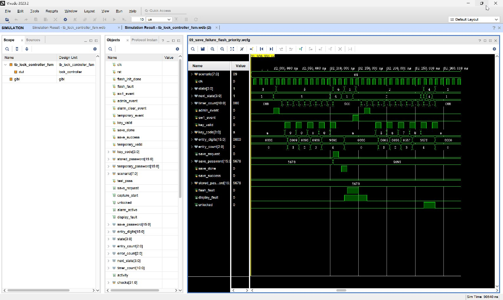

# 09_save_failure_flash_priority：保存失败、故障标志清除与 Flash 故障优先级

窗口：**31960–32330 ns**，连续绝对时间；scenario=9。

## 原生 Vivado 截屏



这是 Vivado 2023.2 的 Wave 面板实际截图，未重绘波形。左侧 Name/Value 列的 Value 是黄色游标位置的瞬时值，不一定是事件发生时的值；请按图中横向时间轴和下表判读。state 编码：0 BOOT、1 WAIT、2 USER、3 ERROR、4 OPEN、5 ADMIN、6 SAVE、7 ALARM、8 TEMP。密码和 key_code 为十六进制 BCD。

## 前置条件

WAIT，上一段已成功保存 5678。

## 当前激励与状态变化

KEY1 提交 9090；save_done=1/save_success=0 使 SAVE→WAIT，display_fault=1，stored_password 保持 5678。flash_fault=1 时送 SW1，虽然进入 USER，但最后赋值优先，故障显示仍为 1。撤销 flash_fault 后送 admin_event，故障标志清零，但 USER 不因此转 ADMIN。输入旧的永久密码 5678+A 仍开锁。

所有事件输入都由测试平台产生一个 10 ns 周期的脉冲。key_valid=1 时 key_code 才是当前新按键；key_valid=0 时保留的 key_code 不是重复激励。next_state 是组合判断，state 在下一上升沿更新；采样后 save_request/capture_start 高一个完整周期。

## 实际端口跳变、采样沿与效果

下表由这次 XSim 的 VCD 数据逐拍反查；`T` ns 的测试平台激励一般在 `clk` 下降沿改变，下一次 `clk` 上升沿在 `T+5` ns 采样。状态/输出用采样后的值，不把 `key_valid` 释放沿误认为第二次按键。表中明确用 0→1 和 1→0 表示端口边沿；若放大窗口中没有新输入边沿，则写明由前序激励或自然计时触发。

| 激励时刻/ns | 输入端口变化 | clk 上升沿/ns | 状态、输出端口实际效果 / 功能 |
| --- | --- | --- | --- |
| 32000 | `admin_event 0→1` | 32005 | `state 1:WAIT/PASS→5:ADMIN/SET` |
| 32010 | `admin_event 1→0` | 32015 | `state=5:ADMIN/SET` 保持 |
| 32020 | `key_valid 0→1`, `key_code A→9` | 32025 | `state=5:ADMIN/SET` 保持, `entry_digits 0000→0009`, `entry_count 0→1`, 有效键码 `9` |
| 32030 | `key_valid 1→0` | 32035 | `state=5:ADMIN/SET` 保持, 按键有效位释放，不重复提交 |
| 32040 | `key_valid 0→1`, `key_code 9→0` | 32045 | `state=5:ADMIN/SET` 保持, `entry_digits 0009→0090`, `entry_count 1→2`, 有效键码 `0` |
| 32050 | `key_valid 1→0` | 32055 | `state=5:ADMIN/SET` 保持, 按键有效位释放，不重复提交 |
| 32060 | `key_valid 0→1`, `key_code 0→9` | 32065 | `state=5:ADMIN/SET` 保持, `entry_digits 0090→0909`, `entry_count 2→3`, 有效键码 `9` |
| 32070 | `key_valid 1→0` | 32075 | `state=5:ADMIN/SET` 保持, 按键有效位释放，不重复提交 |
| 32080 | `key_valid 0→1`, `key_code 9→0` | 32085 | `state=5:ADMIN/SET` 保持, `entry_digits 0909→9090`, `entry_count 3→4`, 有效键码 `0` |
| 32090 | `key_valid 1→0` | 32095 | `state=5:ADMIN/SET` 保持, 按键有效位释放，不重复提交 |
| 32100 | `key_valid 0→1`, `key_code 0→A` | 32105 | `state 5:ADMIN/SET→6:SAVE`, `save_request 0→1`, `save_password 5678→9090`, 有效键码 `A` |
| 32110 | `key_valid 1→0` | 32115 | `state=6:SAVE` 保持, `save_request 1→0`, 按键有效位释放，不重复提交 |
| 32120 | `save_done 0→1` | 32125 | `state 6:SAVE→1:WAIT/PASS`, `entry_digits 9090→0000`, `entry_count 4→0`, `display_fault 0→1` |
| 32130 | `save_done 1→0`, `flash_fault 0→1` | 32135 | `state=1:WAIT/PASS` 保持 |
| 32140 | `sw1_event 0→1` | 32145 | `state 1:WAIT/PASS→2:USER` |
| 32150 | `sw1_event 1→0`, `flash_fault 1→0` | 32155 | `state=2:USER` 保持 |
| 32160 | `admin_event 0→1` | 32165 | `state=2:USER` 保持, `display_fault 1→0` |
| 32170 | `admin_event 1→0` | 32175 | `state=2:USER` 保持 |
| 32180 | `key_valid 0→1`, `key_code A→5` | 32185 | `state=2:USER` 保持, `entry_digits 0000→0005`, `entry_count 0→1`, 有效键码 `5` |
| 32190 | `key_valid 1→0` | 32195 | `state=2:USER` 保持, 按键有效位释放，不重复提交 |
| 32200 | `key_valid 0→1`, `key_code 5→6` | 32205 | `state=2:USER` 保持, `entry_digits 0005→0056`, `entry_count 1→2`, 有效键码 `6` |
| 32210 | `key_valid 1→0` | 32215 | `state=2:USER` 保持, 按键有效位释放，不重复提交 |
| 32220 | `key_valid 0→1`, `key_code 6→7` | 32225 | `state=2:USER` 保持, `entry_digits 0056→0567`, `entry_count 2→3`, 有效键码 `7` |
| 32230 | `key_valid 1→0` | 32235 | `state=2:USER` 保持, 按键有效位释放，不重复提交 |
| 32240 | `key_valid 0→1`, `key_code 7→8` | 32245 | `state=2:USER` 保持, `entry_digits 0567→5678`, `entry_count 3→4`, 有效键码 `8` |
| 32250 | `key_valid 1→0` | 32255 | `state=2:USER` 保持, 按键有效位释放，不重复提交 |
| 32260 | `key_valid 0→1`, `key_code 8→A` | 32265 | `state 2:USER→4:OPEN`, `unlocked 0→1`, 有效键码 `A` |
| 32270 | `key_valid 1→0` | 32275 | `state=4:OPEN` 保持, 按键有效位释放，不重复提交 |
| 32280 | `key_valid 0→1` | 32285 | `state 4:OPEN→1:WAIT/PASS`, `entry_digits 5678→0000`, `entry_count 4→0`, `unlocked 1→0`, 有效键码 `A` |
| 32290 | `key_valid 1→0` | 32295 | `state=1:WAIT/PASS` 保持, 按键有效位释放，不重复提交 |

窗口起点：`rst=0`, `flash_init_done=1`, `sw1_event=0`, `admin_event=0`, `alarm_clear_event=0`, `temporary_event=0`, `key_valid=0`, `key_code=A`, `save_done=0`, `save_success=0`, `stored_password=5678`, `temporary_password=0000`, `temporary_valid=0`, `flash_fault=0`。

## 对应实际功能

KEY1 提交 9090；save_done=1/save_success=0 使 SAVE→WAIT，display_fault=1，stored_password 保持 5678。flash_fault=1 时送 SW1，虽然进入 USER，但最后赋值优先，故障显示仍为 1。撤销 flash_fault 后送 admin_event，故障标志清零，但 USER 不因此转 ADMIN。输入旧的永久密码 5678+A 仍开锁。

## 再次打开与分段截屏

配置：[WCFG](../configs/09_save_failure_flash_priority.wcfg)，完整数据：[WDB](../tb_lock_controller_fsm.wdb)、[VCD](../tb_lock_controller_fsm.vcd)。

在 Vivado Tcl Console 执行（将路径替换为本地仓库路径）：

```tcl
open_wave_database -noautoloadwcfg E:/26FPGA/simulation_waveforms/12_lock_controller_fsm/tb_lock_controller_fsm.wdb
open_wave_config E:/26FPGA/simulation_waveforms/12_lock_controller_fsm/configs/09_save_failure_flash_priority.wcfg
# 时间窗口已内嵌在 WCFG；打开配置即恢复对应分段。
```
