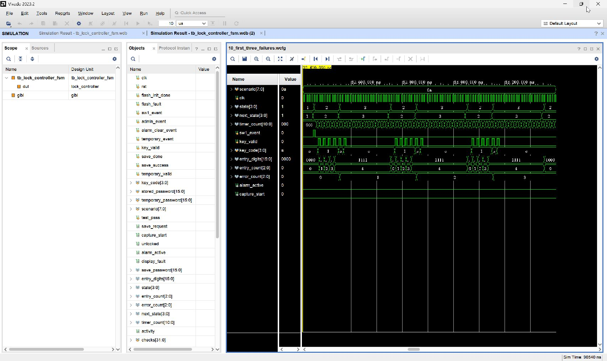

# 10_first_three_failures：前三次错误：Err1、Err2、Err3 与自动重试

窗口：**32410–33400 ns**，连续绝对时间；scenario=10。

## 原生 Vivado 截屏



这是 Vivado 2023.2 的 Wave 面板实际截图，未重绘波形。左侧 Name/Value 列的 Value 是黄色游标位置的瞬时值，不一定是事件发生时的值；请按图中横向时间轴和下表判读。state 编码：0 BOOT、1 WAIT、2 USER、3 ERROR、4 OPEN、5 ADMIN、6 SAVE、7 ALARM、8 TEMP。密码和 key_code 为十六进制 BCD。

## 前置条件

通过复位重新从密码 1234、error_count=0、WAIT 开始。

## 当前激励与状态变化

SW1 开启 USER；三次输入 1111+A 分别 USER→ERROR，error_count=1/2/3。每次提示中按 C 不能退出；20 拍错误显示期满 ERROR→USER，并清空输入以开始下一次尝试。没有 alarm_active 和 capture_start。

所有事件输入都由测试平台产生一个 10 ns 周期的脉冲。key_valid=1 时 key_code 才是当前新按键；key_valid=0 时保留的 key_code 不是重复激励。next_state 是组合判断，state 在下一上升沿更新；采样后 save_request/capture_start 高一个完整周期。

## 实际端口跳变、采样沿与效果

下表由这次 XSim 的 VCD 数据逐拍反查；`T` ns 的测试平台激励一般在 `clk` 下降沿改变，下一次 `clk` 上升沿在 `T+5` ns 采样。状态/输出用采样后的值，不把 `key_valid` 释放沿误认为第二次按键。表中明确用 0→1 和 1→0 表示端口边沿；若放大窗口中没有新输入边沿，则写明由前序激励或自然计时触发。

| 激励时刻/ns | 输入端口变化 | clk 上升沿/ns | 状态、输出端口实际效果 / 功能 |
| --- | --- | --- | --- |
| 32450 | `sw1_event 0→1` | 32455 | `state 1:WAIT/PASS→2:USER` |
| 32460 | `sw1_event 1→0` | 32465 | `state=2:USER` 保持 |
| 32470 | `key_valid 0→1`, `key_code A→1` | 32475 | `state=2:USER` 保持, `entry_digits 0000→0001`, `entry_count 0→1`, 有效键码 `1` |
| 32480 | `key_valid 1→0` | 32485 | `state=2:USER` 保持, 按键有效位释放，不重复提交 |
| 32490 | `key_valid 0→1` | 32495 | `state=2:USER` 保持, `entry_digits 0001→0011`, `entry_count 1→2`, 有效键码 `1` |
| 32500 | `key_valid 1→0` | 32505 | `state=2:USER` 保持, 按键有效位释放，不重复提交 |
| 32510 | `key_valid 0→1` | 32515 | `state=2:USER` 保持, `entry_digits 0011→0111`, `entry_count 2→3`, 有效键码 `1` |
| 32520 | `key_valid 1→0` | 32525 | `state=2:USER` 保持, 按键有效位释放，不重复提交 |
| 32530 | `key_valid 0→1` | 32535 | `state=2:USER` 保持, `entry_digits 0111→1111`, `entry_count 3→4`, 有效键码 `1` |
| 32540 | `key_valid 1→0` | 32545 | `state=2:USER` 保持, 按键有效位释放，不重复提交 |
| 32550 | `key_valid 0→1`, `key_code 1→A` | 32555 | `state 2:USER→3:ERROR`, `error_count 0→1`, 有效键码 `A` |
| 32560 | `key_valid 1→0` | 32565 | `state=3:ERROR` 保持, 按键有效位释放，不重复提交 |
| 32570 | `key_valid 0→1`, `key_code A→C` | 32575 | `state=3:ERROR` 保持, 有效键码 `C` |
| 32580 | `key_valid 1→0` | 32585 | `state=3:ERROR` 保持, 按键有效位释放，不重复提交 |
| 32755 | 无新外部脉冲；计时或状态逻辑自然转移 | 32755 | `state 3:ERROR→2:USER`, `entry_digits 1111→0000`, `entry_count 4→0` |
| 32770 | `key_valid 0→1`, `key_code C→1` | 32775 | `state=2:USER` 保持, `entry_digits 0000→0001`, `entry_count 0→1`, 有效键码 `1` |
| 32780 | `key_valid 1→0` | 32785 | `state=2:USER` 保持, 按键有效位释放，不重复提交 |
| 32790 | `key_valid 0→1` | 32795 | `state=2:USER` 保持, `entry_digits 0001→0011`, `entry_count 1→2`, 有效键码 `1` |
| 32800 | `key_valid 1→0` | 32805 | `state=2:USER` 保持, 按键有效位释放，不重复提交 |
| 32810 | `key_valid 0→1` | 32815 | `state=2:USER` 保持, `entry_digits 0011→0111`, `entry_count 2→3`, 有效键码 `1` |
| 32820 | `key_valid 1→0` | 32825 | `state=2:USER` 保持, 按键有效位释放，不重复提交 |
| 32830 | `key_valid 0→1` | 32835 | `state=2:USER` 保持, `entry_digits 0111→1111`, `entry_count 3→4`, 有效键码 `1` |
| 32840 | `key_valid 1→0` | 32845 | `state=2:USER` 保持, 按键有效位释放，不重复提交 |
| 32850 | `key_valid 0→1`, `key_code 1→A` | 32855 | `state 2:USER→3:ERROR`, `error_count 1→2`, 有效键码 `A` |
| 32860 | `key_valid 1→0` | 32865 | `state=3:ERROR` 保持, 按键有效位释放，不重复提交 |
| 32870 | `key_valid 0→1`, `key_code A→C` | 32875 | `state=3:ERROR` 保持, 有效键码 `C` |
| 32880 | `key_valid 1→0` | 32885 | `state=3:ERROR` 保持, 按键有效位释放，不重复提交 |
| 33055 | 无新外部脉冲；计时或状态逻辑自然转移 | 33055 | `state 3:ERROR→2:USER`, `entry_digits 1111→0000`, `entry_count 4→0` |
| 33070 | `key_valid 0→1`, `key_code C→1` | 33075 | `state=2:USER` 保持, `entry_digits 0000→0001`, `entry_count 0→1`, 有效键码 `1` |
| 33080 | `key_valid 1→0` | 33085 | `state=2:USER` 保持, 按键有效位释放，不重复提交 |
| 33090 | `key_valid 0→1` | 33095 | `state=2:USER` 保持, `entry_digits 0001→0011`, `entry_count 1→2`, 有效键码 `1` |
| 33100 | `key_valid 1→0` | 33105 | `state=2:USER` 保持, 按键有效位释放，不重复提交 |
| 33110 | `key_valid 0→1` | 33115 | `state=2:USER` 保持, `entry_digits 0011→0111`, `entry_count 2→3`, 有效键码 `1` |
| 33120 | `key_valid 1→0` | 33125 | `state=2:USER` 保持, 按键有效位释放，不重复提交 |
| 33130 | `key_valid 0→1` | 33135 | `state=2:USER` 保持, `entry_digits 0111→1111`, `entry_count 3→4`, 有效键码 `1` |
| 33140 | `key_valid 1→0` | 33145 | `state=2:USER` 保持, 按键有效位释放，不重复提交 |
| 33150 | `key_valid 0→1`, `key_code 1→A` | 33155 | `state 2:USER→3:ERROR`, `error_count 2→3`, 有效键码 `A` |
| 33160 | `key_valid 1→0` | 33165 | `state=3:ERROR` 保持, 按键有效位释放，不重复提交 |
| 33170 | `key_valid 0→1`, `key_code A→C` | 33175 | `state=3:ERROR` 保持, 有效键码 `C` |
| 33180 | `key_valid 1→0` | 33185 | `state=3:ERROR` 保持, 按键有效位释放，不重复提交 |
| 33355 | 无新外部脉冲；计时或状态逻辑自然转移 | 33355 | `state 3:ERROR→2:USER`, `entry_digits 1111→0000`, `entry_count 4→0` |

窗口起点：`rst=0`, `flash_init_done=1`, `sw1_event=0`, `admin_event=0`, `alarm_clear_event=0`, `temporary_event=0`, `key_valid=0`, `key_code=A`, `save_done=0`, `save_success=0`, `stored_password=1234`, `temporary_password=0000`, `temporary_valid=0`, `flash_fault=0`。

## 对应实际功能

SW1 开启 USER；三次输入 1111+A 分别 USER→ERROR，error_count=1/2/3。每次提示中按 C 不能退出；20 拍错误显示期满 ERROR→USER，并清空输入以开始下一次尝试。没有 alarm_active 和 capture_start。

## 再次打开与分段截屏

配置：[WCFG](../configs/10_first_three_failures.wcfg)，完整数据：[WDB](../tb_lock_controller_fsm.wdb)、[VCD](../tb_lock_controller_fsm.vcd)。

在 Vivado Tcl Console 执行（将路径替换为本地仓库路径）：

```tcl
open_wave_database -noautoloadwcfg E:/26FPGA/simulation_waveforms/12_lock_controller_fsm/tb_lock_controller_fsm.wdb
open_wave_config E:/26FPGA/simulation_waveforms/12_lock_controller_fsm/configs/10_first_three_failures.wcfg
# 时间窗口已内嵌在 WCFG；打开配置即恢复对应分段。
```
