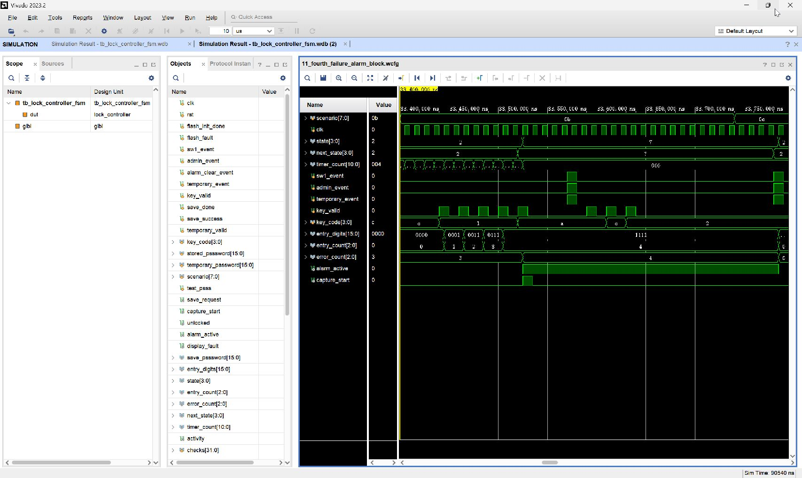

# 11_fourth_failure_alarm_block：第四次错误直接报警、抓拍单脉冲与旁路阻断

窗口：**33400–33740 ns**，连续绝对时间；scenario=11。

## 原生 Vivado 截屏



这是 Vivado 2023.2 的 Wave 面板实际截图，未重绘波形。左侧 Name/Value 列的 Value 是黄色游标位置的瞬时值，不一定是事件发生时的值；请按图中横向时间轴和下表判读。state 编码：0 BOOT、1 WAIT、2 USER、3 ERROR、4 OPEN、5 ADMIN、6 SAVE、7 ALARM、8 TEMP。密码和 key_code 为十六进制 BCD。

## 前置条件

紧接上一段：USER，前三次错误已累计 error_count=3。

## 当前激励与状态变化

再次输入 1111+A，USER→ALARM(7)，error_count=4，alarm_active=1；capture_start 只在进入 ALARM 那一拍为 1。随后 SW1/KEY1/KEY3 同拍及 A、C、数字 2 都不能清除报警，持续停在 ALARM；不会重新抓拍。

所有事件输入都由测试平台产生一个 10 ns 周期的脉冲。key_valid=1 时 key_code 才是当前新按键；key_valid=0 时保留的 key_code 不是重复激励。next_state 是组合判断，state 在下一上升沿更新；采样后 save_request/capture_start 高一个完整周期。

## 实际端口跳变、采样沿与效果

下表由这次 XSim 的 VCD 数据逐拍反查；`T` ns 的测试平台激励一般在 `clk` 下降沿改变，下一次 `clk` 上升沿在 `T+5` ns 采样。状态/输出用采样后的值，不把 `key_valid` 释放沿误认为第二次按键。表中明确用 0→1 和 1→0 表示端口边沿；若放大窗口中没有新输入边沿，则写明由前序激励或自然计时触发。

| 激励时刻/ns | 输入端口变化 | clk 上升沿/ns | 状态、输出端口实际效果 / 功能 |
| --- | --- | --- | --- |
| 33440 | `key_valid 0→1`, `key_code C→1` | 33445 | `state=2:USER` 保持, `entry_digits 0000→0001`, `entry_count 0→1`, 有效键码 `1` |
| 33450 | `key_valid 1→0` | 33455 | `state=2:USER` 保持, 按键有效位释放，不重复提交 |
| 33460 | `key_valid 0→1` | 33465 | `state=2:USER` 保持, `entry_digits 0001→0011`, `entry_count 1→2`, 有效键码 `1` |
| 33470 | `key_valid 1→0` | 33475 | `state=2:USER` 保持, 按键有效位释放，不重复提交 |
| 33480 | `key_valid 0→1` | 33485 | `state=2:USER` 保持, `entry_digits 0011→0111`, `entry_count 2→3`, 有效键码 `1` |
| 33490 | `key_valid 1→0` | 33495 | `state=2:USER` 保持, 按键有效位释放，不重复提交 |
| 33500 | `key_valid 0→1` | 33505 | `state=2:USER` 保持, `entry_digits 0111→1111`, `entry_count 3→4`, 有效键码 `1` |
| 33510 | `key_valid 1→0` | 33515 | `state=2:USER` 保持, 按键有效位释放，不重复提交 |
| 33520 | `key_valid 0→1`, `key_code 1→A` | 33525 | `state 2:USER→7:ALARM`, `error_count 3→4`, `alarm_active 0→1`, `capture_start 0→1`, 有效键码 `A` |
| 33530 | `key_valid 1→0` | 33535 | `state=7:ALARM` 保持, `capture_start 1→0`, 按键有效位释放，不重复提交 |
| 33570 | `sw1_event 0→1`, `admin_event 0→1`, `temporary_event 0→1` | 33575 | `state=7:ALARM` 保持 |
| 33580 | `sw1_event 1→0`, `admin_event 1→0`, `temporary_event 1→0` | 33585 | `state=7:ALARM` 保持 |
| 33590 | `key_valid 0→1` | 33595 | `state=7:ALARM` 保持, 有效键码 `A` |
| 33600 | `key_valid 1→0` | 33605 | `state=7:ALARM` 保持, 按键有效位释放，不重复提交 |
| 33610 | `key_valid 0→1`, `key_code A→C` | 33615 | `state=7:ALARM` 保持, 有效键码 `C` |
| 33620 | `key_valid 1→0` | 33625 | `state=7:ALARM` 保持, 按键有效位释放，不重复提交 |
| 33630 | `key_valid 0→1`, `key_code C→2` | 33635 | `state=7:ALARM` 保持, 有效键码 `2` |
| 33640 | `key_valid 1→0` | 33645 | `state=7:ALARM` 保持, 按键有效位释放，不重复提交 |

窗口起点：`rst=0`, `flash_init_done=1`, `sw1_event=0`, `admin_event=0`, `alarm_clear_event=0`, `temporary_event=0`, `key_valid=0`, `key_code=C`, `save_done=0`, `save_success=0`, `stored_password=1234`, `temporary_password=0000`, `temporary_valid=0`, `flash_fault=0`。

## 对应实际功能

再次输入 1111+A，USER→ALARM(7)，error_count=4，alarm_active=1；capture_start 只在进入 ALARM 那一拍为 1。随后 SW1/KEY1/KEY3 同拍及 A、C、数字 2 都不能清除报警，持续停在 ALARM；不会重新抓拍。

## 再次打开与分段截屏

配置：[WCFG](../configs/11_fourth_failure_alarm_block.wcfg)，完整数据：[WDB](../tb_lock_controller_fsm.wdb)、[VCD](../tb_lock_controller_fsm.vcd)。

在 Vivado Tcl Console 执行（将路径替换为本地仓库路径）：

```tcl
open_wave_database -noautoloadwcfg E:/26FPGA/simulation_waveforms/12_lock_controller_fsm/tb_lock_controller_fsm.wdb
open_wave_config E:/26FPGA/simulation_waveforms/12_lock_controller_fsm/configs/11_fourth_failure_alarm_block.wcfg
# 时间窗口已内嵌在 WCFG；打开配置即恢复对应分段。
```
