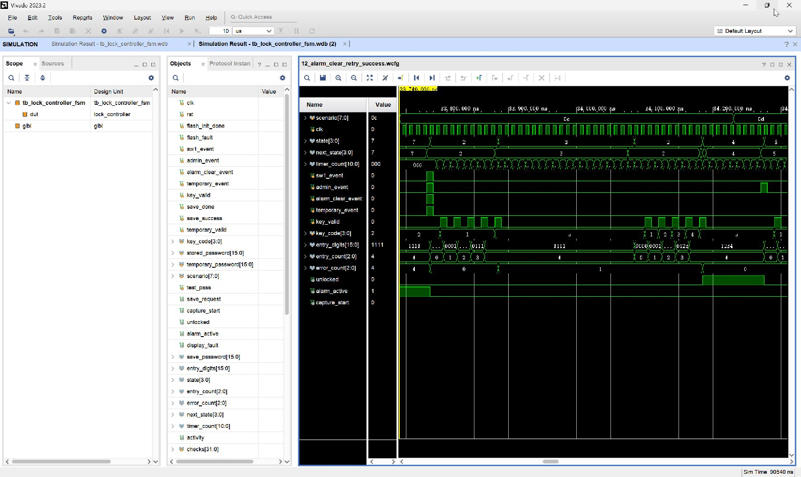

# 12_alarm_clear_retry_success：KEY2 解除报警、新错误窗口与成功清零

窗口：**33740–34230 ns**，连续绝对时间；scenario=12。

## 原生 Vivado 截屏



这是 Vivado 2023.2 的 Wave 面板实际截图，未重绘波形。左侧 Name/Value 列的 Value 是黄色游标位置的瞬时值，不一定是事件发生时的值；请按图中横向时间轴和下表判读。state 编码：0 BOOT、1 WAIT、2 USER、3 ERROR、4 OPEN、5 ADMIN、6 SAVE、7 ALARM、8 TEMP。密码和 key_code 为十六进制 BCD。

## 前置条件

ALARM，error_count=4，锁未开。

## 当前激励与状态变化

KEY2(alarm_clear_event) 与其他三入口同拍，只有 KEY2 的报警清除路径有效：ALARM→USER，alarm_active=0、error_count=0、输入清零。1111+A 得到 ERROR/Err1；提示结束后输入 1234+A 使 USER→OPEN，并清零历史错误。

所有事件输入都由测试平台产生一个 10 ns 周期的脉冲。key_valid=1 时 key_code 才是当前新按键；key_valid=0 时保留的 key_code 不是重复激励。next_state 是组合判断，state 在下一上升沿更新；采样后 save_request/capture_start 高一个完整周期。

## 实际端口跳变、采样沿与效果

下表由这次 XSim 的 VCD 数据逐拍反查；`T` ns 的测试平台激励一般在 `clk` 下降沿改变，下一次 `clk` 上升沿在 `T+5` ns 采样。状态/输出用采样后的值，不把 `key_valid` 释放沿误认为第二次按键。表中明确用 0→1 和 1→0 表示端口边沿；若放大窗口中没有新输入边沿，则写明由前序激励或自然计时触发。

| 激励时刻/ns | 输入端口变化 | clk 上升沿/ns | 状态、输出端口实际效果 / 功能 |
| --- | --- | --- | --- |
| 33780 | `sw1_event 0→1`, `admin_event 0→1`, `alarm_clear_event 0→1`, `temporary_event 0→1` | 33785 | `state 7:ALARM→2:USER`, `entry_digits 1111→0000`, `entry_count 4→0`, `error_count 4→0`, `alarm_active 1→0` |
| 33790 | `sw1_event 1→0`, `admin_event 1→0`, `alarm_clear_event 1→0`, `temporary_event 1→0` | 33795 | `state=2:USER` 保持 |
| 33800 | `key_valid 0→1`, `key_code 2→1` | 33805 | `state=2:USER` 保持, `entry_digits 0000→0001`, `entry_count 0→1`, 有效键码 `1` |
| 33810 | `key_valid 1→0` | 33815 | `state=2:USER` 保持, 按键有效位释放，不重复提交 |
| 33820 | `key_valid 0→1` | 33825 | `state=2:USER` 保持, `entry_digits 0001→0011`, `entry_count 1→2`, 有效键码 `1` |
| 33830 | `key_valid 1→0` | 33835 | `state=2:USER` 保持, 按键有效位释放，不重复提交 |
| 33840 | `key_valid 0→1` | 33845 | `state=2:USER` 保持, `entry_digits 0011→0111`, `entry_count 2→3`, 有效键码 `1` |
| 33850 | `key_valid 1→0` | 33855 | `state=2:USER` 保持, 按键有效位释放，不重复提交 |
| 33860 | `key_valid 0→1` | 33865 | `state=2:USER` 保持, `entry_digits 0111→1111`, `entry_count 3→4`, 有效键码 `1` |
| 33870 | `key_valid 1→0` | 33875 | `state=2:USER` 保持, 按键有效位释放，不重复提交 |
| 33880 | `key_valid 0→1`, `key_code 1→A` | 33885 | `state 2:USER→3:ERROR`, `error_count 0→1`, 有效键码 `A` |
| 33890 | `key_valid 1→0` | 33895 | `state=3:ERROR` 保持, 按键有效位释放，不重复提交 |
| 34085 | 无新外部脉冲；计时或状态逻辑自然转移 | 34085 | `state 3:ERROR→2:USER`, `entry_digits 1111→0000`, `entry_count 4→0` |
| 34100 | `key_valid 0→1`, `key_code A→1` | 34105 | `state=2:USER` 保持, `entry_digits 0000→0001`, `entry_count 0→1`, 有效键码 `1` |
| 34110 | `key_valid 1→0` | 34115 | `state=2:USER` 保持, 按键有效位释放，不重复提交 |
| 34120 | `key_valid 0→1`, `key_code 1→2` | 34125 | `state=2:USER` 保持, `entry_digits 0001→0012`, `entry_count 1→2`, 有效键码 `2` |
| 34130 | `key_valid 1→0` | 34135 | `state=2:USER` 保持, 按键有效位释放，不重复提交 |
| 34140 | `key_valid 0→1`, `key_code 2→3` | 34145 | `state=2:USER` 保持, `entry_digits 0012→0123`, `entry_count 2→3`, 有效键码 `3` |
| 34150 | `key_valid 1→0` | 34155 | `state=2:USER` 保持, 按键有效位释放，不重复提交 |
| 34160 | `key_valid 0→1`, `key_code 3→4` | 34165 | `state=2:USER` 保持, `entry_digits 0123→1234`, `entry_count 3→4`, 有效键码 `4` |
| 34170 | `key_valid 1→0` | 34175 | `state=2:USER` 保持, 按键有效位释放，不重复提交 |
| 34180 | `key_valid 0→1`, `key_code 4→A` | 34185 | `state 2:USER→4:OPEN`, `error_count 1→0`, `unlocked 0→1`, 有效键码 `A` |
| 34190 | `key_valid 1→0` | 34195 | `state=4:OPEN` 保持, 按键有效位释放，不重复提交 |

窗口起点：`rst=0`, `flash_init_done=1`, `sw1_event=0`, `admin_event=0`, `alarm_clear_event=0`, `temporary_event=0`, `key_valid=0`, `key_code=2`, `save_done=0`, `save_success=0`, `stored_password=1234`, `temporary_password=0000`, `temporary_valid=0`, `flash_fault=0`。

## 对应实际功能

KEY2(alarm_clear_event) 与其他三入口同拍，只有 KEY2 的报警清除路径有效：ALARM→USER，alarm_active=0、error_count=0、输入清零。1111+A 得到 ERROR/Err1；提示结束后输入 1234+A 使 USER→OPEN，并清零历史错误。

## 再次打开与分段截屏

配置：[WCFG](../configs/12_alarm_clear_retry_success.wcfg)，完整数据：[WDB](../tb_lock_controller_fsm.wdb)、[VCD](../tb_lock_controller_fsm.vcd)。

在 Vivado Tcl Console 执行（将路径替换为本地仓库路径）：

```tcl
open_wave_database -noautoloadwcfg E:/26FPGA/simulation_waveforms/12_lock_controller_fsm/tb_lock_controller_fsm.wdb
open_wave_config E:/26FPGA/simulation_waveforms/12_lock_controller_fsm/configs/12_alarm_clear_retry_success.wcfg
# 时间窗口已内嵌在 WCFG；打开配置即恢复对应分段。
```
