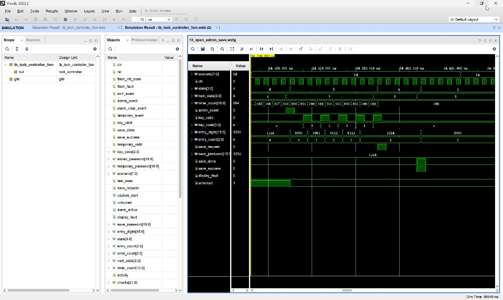

# 13_open_admin_save：开锁期间进入管理员并保存

窗口：**34230–34470 ns**，连续绝对时间；scenario=13。

## 原生 Vivado 截屏



这是 Vivado 2023.2 的 Wave 面板实际截图，未重绘波形。左侧 Name/Value 列的 Value 是黄色游标位置的瞬时值，不一定是事件发生时的值；请按图中横向时间轴和下表判读。state 编码：0 BOOT、1 WAIT、2 USER、3 ERROR、4 OPEN、5 ADMIN、6 SAVE、7 ALARM、8 TEMP。密码和 key_code 为十六进制 BCD。

## 前置条件

上一段结束在 OPEN，已成功验证 1234。

## 当前激励与状态变化

KEY1 使 OPEN→ADMIN，同时 unlocked 变 0；输入缓存清空。输入 1234+A 使 ADMIN→SAVE，保存请求高一拍。save_done=1/save_success=1 后 SAVE→WAIT，不显示故障。该段与 WAIT→ADMIN 的入口不同。

所有事件输入都由测试平台产生一个 10 ns 周期的脉冲。key_valid=1 时 key_code 才是当前新按键；key_valid=0 时保留的 key_code 不是重复激励。next_state 是组合判断，state 在下一上升沿更新；采样后 save_request/capture_start 高一个完整周期。

## 实际端口跳变、采样沿与效果

下表由这次 XSim 的 VCD 数据逐拍反查；`T` ns 的测试平台激励一般在 `clk` 下降沿改变，下一次 `clk` 上升沿在 `T+5` ns 采样。状态/输出用采样后的值，不把 `key_valid` 释放沿误认为第二次按键。表中明确用 0→1 和 1→0 表示端口边沿；若放大窗口中没有新输入边沿，则写明由前序激励或自然计时触发。

| 激励时刻/ns | 输入端口变化 | clk 上升沿/ns | 状态、输出端口实际效果 / 功能 |
| --- | --- | --- | --- |
| 34270 | `admin_event 0→1` | 34275 | `state 4:OPEN→5:ADMIN/SET`, `entry_digits 1234→0000`, `entry_count 4→0`, `unlocked 1→0` |
| 34280 | `admin_event 1→0` | 34285 | `state=5:ADMIN/SET` 保持 |
| 34290 | `key_valid 0→1`, `key_code A→1` | 34295 | `state=5:ADMIN/SET` 保持, `entry_digits 0000→0001`, `entry_count 0→1`, 有效键码 `1` |
| 34300 | `key_valid 1→0` | 34305 | `state=5:ADMIN/SET` 保持, 按键有效位释放，不重复提交 |
| 34310 | `key_valid 0→1`, `key_code 1→2` | 34315 | `state=5:ADMIN/SET` 保持, `entry_digits 0001→0012`, `entry_count 1→2`, 有效键码 `2` |
| 34320 | `key_valid 1→0` | 34325 | `state=5:ADMIN/SET` 保持, 按键有效位释放，不重复提交 |
| 34330 | `key_valid 0→1`, `key_code 2→3` | 34335 | `state=5:ADMIN/SET` 保持, `entry_digits 0012→0123`, `entry_count 2→3`, 有效键码 `3` |
| 34340 | `key_valid 1→0` | 34345 | `state=5:ADMIN/SET` 保持, 按键有效位释放，不重复提交 |
| 34350 | `key_valid 0→1`, `key_code 3→4` | 34355 | `state=5:ADMIN/SET` 保持, `entry_digits 0123→1234`, `entry_count 3→4`, 有效键码 `4` |
| 34360 | `key_valid 1→0` | 34365 | `state=5:ADMIN/SET` 保持, 按键有效位释放，不重复提交 |
| 34370 | `key_valid 0→1`, `key_code 4→A` | 34375 | `state 5:ADMIN/SET→6:SAVE`, `save_request 0→1`, 有效键码 `A` |
| 34380 | `key_valid 1→0` | 34385 | `state=6:SAVE` 保持, `save_request 1→0`, 按键有效位释放，不重复提交 |
| 34420 | `save_done 0→1`, `save_success 0→1` | 34425 | `state 6:SAVE→1:WAIT/PASS`, `entry_digits 1234→0000`, `entry_count 4→0` |
| 34430 | `save_done 1→0`, `save_success 1→0` | 34435 | `state=1:WAIT/PASS` 保持 |

窗口起点：`rst=0`, `flash_init_done=1`, `sw1_event=0`, `admin_event=0`, `alarm_clear_event=0`, `temporary_event=0`, `key_valid=0`, `key_code=A`, `save_done=0`, `save_success=0`, `stored_password=1234`, `temporary_password=0000`, `temporary_valid=0`, `flash_fault=0`。

## 对应实际功能

KEY1 使 OPEN→ADMIN，同时 unlocked 变 0；输入缓存清空。输入 1234+A 使 ADMIN→SAVE，保存请求高一拍。save_done=1/save_success=1 后 SAVE→WAIT，不显示故障。该段与 WAIT→ADMIN 的入口不同。

## 再次打开与分段截屏

配置：[WCFG](../configs/13_open_admin_save.wcfg)，完整数据：[WDB](../tb_lock_controller_fsm.wdb)、[VCD](../tb_lock_controller_fsm.vcd)。

在 Vivado Tcl Console 执行（将路径替换为本地仓库路径）：

```tcl
open_wave_database -noautoloadwcfg E:/26FPGA/simulation_waveforms/12_lock_controller_fsm/tb_lock_controller_fsm.wdb
open_wave_config E:/26FPGA/simulation_waveforms/12_lock_controller_fsm/configs/13_open_admin_save.wcfg
# 时间窗口已内嵌在 WCFG；打开配置即恢复对应分段。
```
