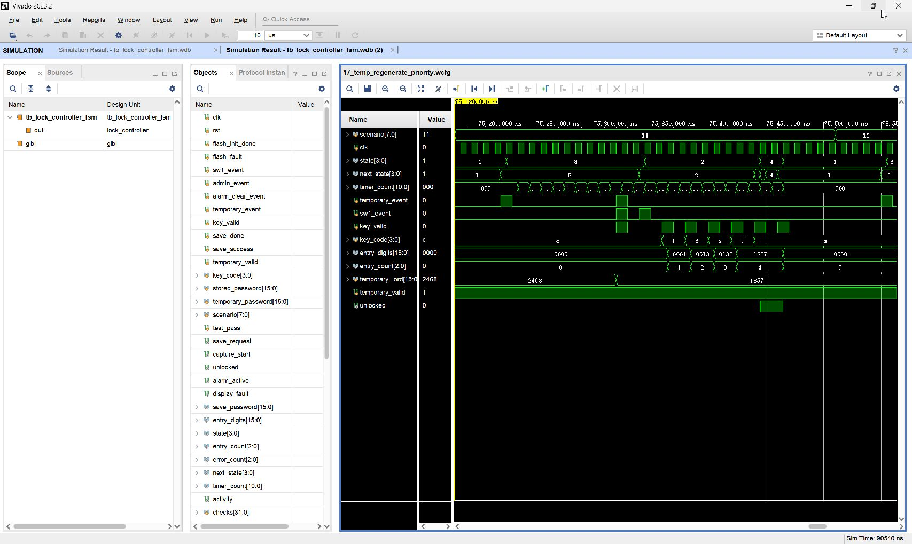

# 17_temp_regenerate_priority：TEMP 重新生成自环、显示计时重启及临时密码开锁

窗口：**75180–75510 ns**，连续绝对时间；scenario=17。

## 原生 Vivado 截屏



这是 Vivado 2023.2 的 Wave 面板实际截图，未重绘波形。左侧 Name/Value 列的 Value 是黄色游标位置的瞬时值，不一定是事件发生时的值；请按图中横向时间轴和下表判读。state 编码：0 BOOT、1 WAIT、2 USER、3 ERROR、4 OPEN、5 ADMIN、6 SAVE、7 ALARM、8 TEMP。密码和 key_code 为十六进制 BCD。

## 前置条件

WAIT，已有有效临时密码 2468。

## 当前激励与状态变化

KEY3→TEMP，等待若干拍。模拟生成器把临时密码替换为 1357，再让 KEY3、SW1、C 同拍：重新生成优先，state 留在 TEMP(自环)，timer_count 清零。随后单独 SW1 使 TEMP→USER；1357+A 匹配有效临时密码，USER→OPEN，再 A 关闭。

所有事件输入都由测试平台产生一个 10 ns 周期的脉冲。key_valid=1 时 key_code 才是当前新按键；key_valid=0 时保留的 key_code 不是重复激励。next_state 是组合判断，state 在下一上升沿更新；采样后 save_request/capture_start 高一个完整周期。

## 实际端口跳变、采样沿与效果

下表由这次 XSim 的 VCD 数据逐拍反查；`T` ns 的测试平台激励一般在 `clk` 下降沿改变，下一次 `clk` 上升沿在 `T+5` ns 采样。状态/输出用采样后的值，不把 `key_valid` 释放沿误认为第二次按键。表中明确用 0→1 和 1→0 表示端口边沿；若放大窗口中没有新输入边沿，则写明由前序激励或自然计时触发。

| 激励时刻/ns | 输入端口变化 | clk 上升沿/ns | 状态、输出端口实际效果 / 功能 |
| --- | --- | --- | --- |
| 75220 | `temporary_event 0→1` | 75225 | `state 1:WAIT/PASS→8:TEMP` |
| 75230 | `temporary_event 1→0` | 75235 | `state=8:TEMP` 保持 |
| 75320 | `sw1_event 0→1`, `temporary_event 0→1`, `key_valid 0→1`, `temporary_password 2468→1357` | 75325 | `state=8:TEMP` 保持, 有效键码 `C` |
| 75330 | `sw1_event 1→0`, `temporary_event 1→0`, `key_valid 1→0` | 75335 | `state=8:TEMP` 保持, 按键有效位释放，不重复提交 |
| 75340 | `sw1_event 0→1` | 75345 | `state 8:TEMP→2:USER` |
| 75350 | `sw1_event 1→0` | 75355 | `state=2:USER` 保持 |
| 75360 | `key_valid 0→1`, `key_code C→1` | 75365 | `state=2:USER` 保持, `entry_digits 0000→0001`, `entry_count 0→1`, 有效键码 `1` |
| 75370 | `key_valid 1→0` | 75375 | `state=2:USER` 保持, 按键有效位释放，不重复提交 |
| 75380 | `key_valid 0→1`, `key_code 1→3` | 75385 | `state=2:USER` 保持, `entry_digits 0001→0013`, `entry_count 1→2`, 有效键码 `3` |
| 75390 | `key_valid 1→0` | 75395 | `state=2:USER` 保持, 按键有效位释放，不重复提交 |
| 75400 | `key_valid 0→1`, `key_code 3→5` | 75405 | `state=2:USER` 保持, `entry_digits 0013→0135`, `entry_count 2→3`, 有效键码 `5` |
| 75410 | `key_valid 1→0` | 75415 | `state=2:USER` 保持, 按键有效位释放，不重复提交 |
| 75420 | `key_valid 0→1`, `key_code 5→7` | 75425 | `state=2:USER` 保持, `entry_digits 0135→1357`, `entry_count 3→4`, 有效键码 `7` |
| 75430 | `key_valid 1→0` | 75435 | `state=2:USER` 保持, 按键有效位释放，不重复提交 |
| 75440 | `key_valid 0→1`, `key_code 7→A` | 75445 | `state 2:USER→4:OPEN`, `unlocked 0→1`, 有效键码 `A` |
| 75450 | `key_valid 1→0` | 75455 | `state=4:OPEN` 保持, 按键有效位释放，不重复提交 |
| 75460 | `key_valid 0→1` | 75465 | `state 4:OPEN→1:WAIT/PASS`, `entry_digits 1357→0000`, `entry_count 4→0`, `unlocked 1→0`, 有效键码 `A` |
| 75470 | `key_valid 1→0` | 75475 | `state=1:WAIT/PASS` 保持, 按键有效位释放，不重复提交 |

窗口起点：`rst=0`, `flash_init_done=1`, `sw1_event=0`, `admin_event=0`, `alarm_clear_event=0`, `temporary_event=0`, `key_valid=0`, `key_code=C`, `save_done=0`, `save_success=0`, `stored_password=1234`, `temporary_password=2468`, `temporary_valid=1`, `flash_fault=0`。

## 对应实际功能

KEY3→TEMP，等待若干拍。模拟生成器把临时密码替换为 1357，再让 KEY3、SW1、C 同拍：重新生成优先，state 留在 TEMP(自环)，timer_count 清零。随后单独 SW1 使 TEMP→USER；1357+A 匹配有效临时密码，USER→OPEN，再 A 关闭。

## 再次打开与分段截屏

配置：[WCFG](../configs/17_temp_regenerate_priority.wcfg)，完整数据：[WDB](../tb_lock_controller_fsm.wdb)、[VCD](../tb_lock_controller_fsm.vcd)。

在 Vivado Tcl Console 执行（将路径替换为本地仓库路径）：

```tcl
open_wave_database -noautoloadwcfg E:/26FPGA/simulation_waveforms/12_lock_controller_fsm/tb_lock_controller_fsm.wdb
open_wave_config E:/26FPGA/simulation_waveforms/12_lock_controller_fsm/configs/17_temp_regenerate_priority.wcfg
# 时间窗口已内嵌在 WCFG；打开配置即恢复对应分段。
```
