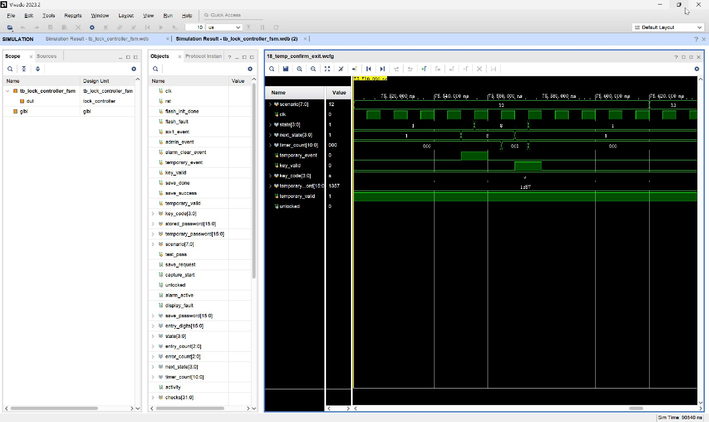

# 18_temp_confirm_exit：TEMP 显示按 A 返回等待

窗口：**75510–75620 ns**，连续绝对时间；scenario=18。

## 原生 Vivado 截屏



这是 Vivado 2023.2 的 Wave 面板实际截图，未重绘波形。左侧 Name/Value 列的 Value 是黄色游标位置的瞬时值，不一定是事件发生时的值；请按图中横向时间轴和下表判读。state 编码：0 BOOT、1 WAIT、2 USER、3 ERROR、4 OPEN、5 ADMIN、6 SAVE、7 ALARM、8 TEMP。密码和 key_code 为十六进制 BCD。

## 前置条件

WAIT，temporary_password=1357、temporary_valid=1。

## 当前激励与状态变化

KEY3 进入 TEMP；key_valid=1/key_code=A 的上升沿 TEMP→WAIT。这里的 A 是退出临时密码显示，并不是用户密码提交，不会开锁。

所有事件输入都由测试平台产生一个 10 ns 周期的脉冲。key_valid=1 时 key_code 才是当前新按键；key_valid=0 时保留的 key_code 不是重复激励。next_state 是组合判断，state 在下一上升沿更新；采样后 save_request/capture_start 高一个完整周期。

## 实际端口跳变、采样沿与效果

下表由这次 XSim 的 VCD 数据逐拍反查；`T` ns 的测试平台激励一般在 `clk` 下降沿改变，下一次 `clk` 上升沿在 `T+5` ns 采样。状态/输出用采样后的值，不把 `key_valid` 释放沿误认为第二次按键。表中明确用 0→1 和 1→0 表示端口边沿；若放大窗口中没有新输入边沿，则写明由前序激励或自然计时触发。

| 激励时刻/ns | 输入端口变化 | clk 上升沿/ns | 状态、输出端口实际效果 / 功能 |
| --- | --- | --- | --- |
| 75550 | `temporary_event 0→1` | 75555 | `state 1:WAIT/PASS→8:TEMP` |
| 75560 | `temporary_event 1→0` | 75565 | `state=8:TEMP` 保持 |
| 75570 | `key_valid 0→1` | 75575 | `state 8:TEMP→1:WAIT/PASS`, 有效键码 `A` |
| 75580 | `key_valid 1→0` | 75585 | `state=1:WAIT/PASS` 保持, 按键有效位释放，不重复提交 |

窗口起点：`rst=0`, `flash_init_done=1`, `sw1_event=0`, `admin_event=0`, `alarm_clear_event=0`, `temporary_event=0`, `key_valid=0`, `key_code=A`, `save_done=0`, `save_success=0`, `stored_password=1234`, `temporary_password=1357`, `temporary_valid=1`, `flash_fault=0`。

## 对应实际功能

KEY3 进入 TEMP；key_valid=1/key_code=A 的上升沿 TEMP→WAIT。这里的 A 是退出临时密码显示，并不是用户密码提交，不会开锁。

## 再次打开与分段截屏

配置：[WCFG](../configs/18_temp_confirm_exit.wcfg)，完整数据：[WDB](../tb_lock_controller_fsm.wdb)、[VCD](../tb_lock_controller_fsm.vcd)。

在 Vivado Tcl Console 执行（将路径替换为本地仓库路径）：

```tcl
open_wave_database -noautoloadwcfg E:/26FPGA/simulation_waveforms/12_lock_controller_fsm/tb_lock_controller_fsm.wdb
open_wave_config E:/26FPGA/simulation_waveforms/12_lock_controller_fsm/configs/18_temp_confirm_exit.wcfg
# 时间窗口已内嵌在 WCFG；打开配置即恢复对应分段。
```
