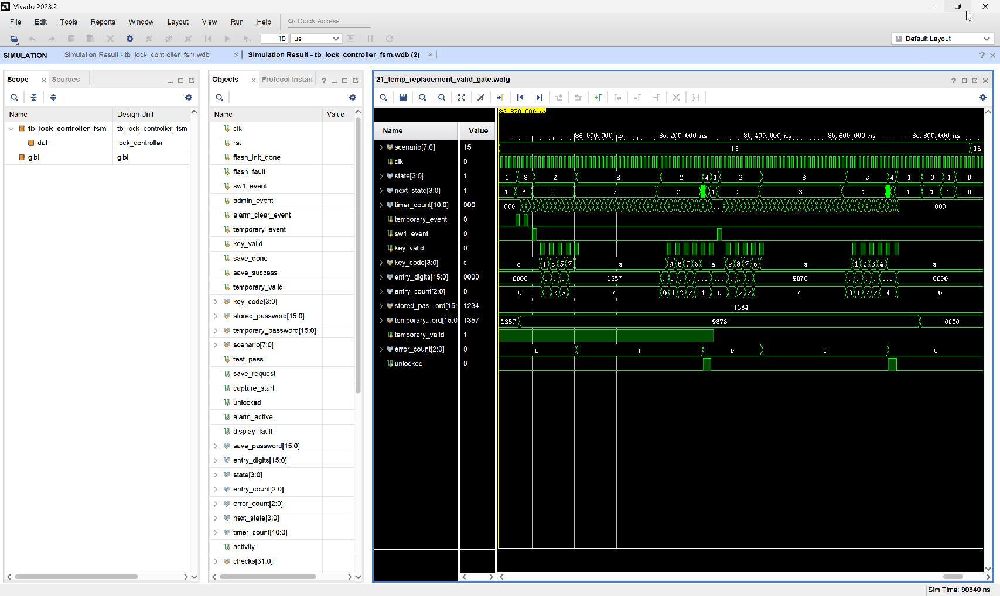

# 21_temp_replacement_valid_gate：临时密码替换拒绝旧值、有效位门控和永久密码共存

窗口：**85820–86810 ns**，连续绝对时间；scenario=21。

## 原生 Vivado 截屏



这是 Vivado 2023.2 的 Wave 面板实际截图，未重绘波形。左侧 Name/Value 列的 Value 是黄色游标位置的瞬时值，不一定是事件发生时的值；请按图中横向时间轴和下表判读。state 编码：0 BOOT、1 WAIT、2 USER、3 ERROR、4 OPEN、5 ADMIN、6 SAVE、7 ALARM、8 TEMP。密码和 key_code 为十六进制 BCD。

## 前置条件

WAIT，原临时密码 1357 有效，永久密码 1234。

## 当前激励与状态变化

进入 TEMP 后把临时密码替换为 9876并重新生成；SW1 后输入旧 1357+A→ERROR。自动重试输入新 9876+A→OPEN。关闭后撤销 temporary_valid，即便输入值仍匹配 9876，A 也得到 ERROR。再次重试输入永久 1234+A 仍开锁。新旧密码与有效位均画出。

所有事件输入都由测试平台产生一个 10 ns 周期的脉冲。key_valid=1 时 key_code 才是当前新按键；key_valid=0 时保留的 key_code 不是重复激励。next_state 是组合判断，state 在下一上升沿更新；采样后 save_request/capture_start 高一个完整周期。

## 实际端口跳变、采样沿与效果

下表由这次 XSim 的 VCD 数据逐拍反查；`T` ns 的测试平台激励一般在 `clk` 下降沿改变，下一次 `clk` 上升沿在 `T+5` ns 采样。状态/输出用采样后的值，不把 `key_valid` 释放沿误认为第二次按键。表中明确用 0→1 和 1→0 表示端口边沿；若放大窗口中没有新输入边沿，则写明由前序激励或自然计时触发。

| 激励时刻/ns | 输入端口变化 | clk 上升沿/ns | 状态、输出端口实际效果 / 功能 |
| --- | --- | --- | --- |
| 85860 | `temporary_event 0→1` | 85865 | `state 1:WAIT/PASS→8:TEMP` |
| 85870 | `temporary_event 1→0`, `temporary_password 1357→9876` | 85875 | `state=8:TEMP` 保持 |
| 85880 | `temporary_event 0→1` | 85885 | `state=8:TEMP` 保持 |
| 85890 | `temporary_event 1→0` | 85895 | `state=8:TEMP` 保持 |
| 85900 | `sw1_event 0→1` | 85905 | `state 8:TEMP→2:USER` |
| 85910 | `sw1_event 1→0` | 85915 | `state=2:USER` 保持 |
| 85920 | `key_valid 0→1`, `key_code C→1` | 85925 | `state=2:USER` 保持, `entry_digits 0000→0001`, `entry_count 0→1`, 有效键码 `1` |
| 85930 | `key_valid 1→0` | 85935 | `state=2:USER` 保持, 按键有效位释放，不重复提交 |
| 85940 | `key_valid 0→1`, `key_code 1→3` | 85945 | `state=2:USER` 保持, `entry_digits 0001→0013`, `entry_count 1→2`, 有效键码 `3` |
| 85950 | `key_valid 1→0` | 85955 | `state=2:USER` 保持, 按键有效位释放，不重复提交 |
| 85960 | `key_valid 0→1`, `key_code 3→5` | 85965 | `state=2:USER` 保持, `entry_digits 0013→0135`, `entry_count 2→3`, 有效键码 `5` |
| 85970 | `key_valid 1→0` | 85975 | `state=2:USER` 保持, 按键有效位释放，不重复提交 |
| 85980 | `key_valid 0→1`, `key_code 5→7` | 85985 | `state=2:USER` 保持, `entry_digits 0135→1357`, `entry_count 3→4`, 有效键码 `7` |
| 85990 | `key_valid 1→0` | 85995 | `state=2:USER` 保持, 按键有效位释放，不重复提交 |
| 86000 | `key_valid 0→1`, `key_code 7→A` | 86005 | `state 2:USER→3:ERROR`, `error_count 0→1`, 有效键码 `A` |
| 86010 | `key_valid 1→0` | 86015 | `state=3:ERROR` 保持, 按键有效位释放，不重复提交 |
| 86205 | 无新外部脉冲；计时或状态逻辑自然转移 | 86205 | `state 3:ERROR→2:USER`, `entry_digits 1357→0000`, `entry_count 4→0` |
| 86220 | `key_valid 0→1`, `key_code A→9` | 86225 | `state=2:USER` 保持, `entry_digits 0000→0009`, `entry_count 0→1`, 有效键码 `9` |
| 86230 | `key_valid 1→0` | 86235 | `state=2:USER` 保持, 按键有效位释放，不重复提交 |
| 86240 | `key_valid 0→1`, `key_code 9→8` | 86245 | `state=2:USER` 保持, `entry_digits 0009→0098`, `entry_count 1→2`, 有效键码 `8` |
| 86250 | `key_valid 1→0` | 86255 | `state=2:USER` 保持, 按键有效位释放，不重复提交 |
| 86260 | `key_valid 0→1`, `key_code 8→7` | 86265 | `state=2:USER` 保持, `entry_digits 0098→0987`, `entry_count 2→3`, 有效键码 `7` |
| 86270 | `key_valid 1→0` | 86275 | `state=2:USER` 保持, 按键有效位释放，不重复提交 |
| 86280 | `key_valid 0→1`, `key_code 7→6` | 86285 | `state=2:USER` 保持, `entry_digits 0987→9876`, `entry_count 3→4`, 有效键码 `6` |
| 86290 | `key_valid 1→0` | 86295 | `state=2:USER` 保持, 按键有效位释放，不重复提交 |
| 86300 | `key_valid 0→1`, `key_code 6→A` | 86305 | `state 2:USER→4:OPEN`, `error_count 1→0`, `unlocked 0→1`, 有效键码 `A` |
| 86310 | `key_valid 1→0` | 86315 | `state=4:OPEN` 保持, 按键有效位释放，不重复提交 |
| 86320 | `key_valid 0→1` | 86325 | `state 4:OPEN→1:WAIT/PASS`, `entry_digits 9876→0000`, `entry_count 4→0`, `unlocked 1→0`, 有效键码 `A` |
| 86330 | `key_valid 1→0`, `temporary_valid 1→0` | 86335 | `state=1:WAIT/PASS` 保持, 按键有效位释放，不重复提交 |
| 86340 | `sw1_event 0→1` | 86345 | `state 1:WAIT/PASS→2:USER` |
| 86350 | `sw1_event 1→0` | 86355 | `state=2:USER` 保持 |
| 86360 | `key_valid 0→1`, `key_code A→9` | 86365 | `state=2:USER` 保持, `entry_digits 0000→0009`, `entry_count 0→1`, 有效键码 `9` |
| 86370 | `key_valid 1→0` | 86375 | `state=2:USER` 保持, 按键有效位释放，不重复提交 |
| 86380 | `key_valid 0→1`, `key_code 9→8` | 86385 | `state=2:USER` 保持, `entry_digits 0009→0098`, `entry_count 1→2`, 有效键码 `8` |
| 86390 | `key_valid 1→0` | 86395 | `state=2:USER` 保持, 按键有效位释放，不重复提交 |
| 86400 | `key_valid 0→1`, `key_code 8→7` | 86405 | `state=2:USER` 保持, `entry_digits 0098→0987`, `entry_count 2→3`, 有效键码 `7` |
| 86410 | `key_valid 1→0` | 86415 | `state=2:USER` 保持, 按键有效位释放，不重复提交 |
| 86420 | `key_valid 0→1`, `key_code 7→6` | 86425 | `state=2:USER` 保持, `entry_digits 0987→9876`, `entry_count 3→4`, 有效键码 `6` |
| 86430 | `key_valid 1→0` | 86435 | `state=2:USER` 保持, 按键有效位释放，不重复提交 |
| 86440 | `key_valid 0→1`, `key_code 6→A` | 86445 | `state 2:USER→3:ERROR`, `error_count 0→1`, 有效键码 `A` |
| 86450 | `key_valid 1→0` | 86455 | `state=3:ERROR` 保持, 按键有效位释放，不重复提交 |
| 86645 | 无新外部脉冲；计时或状态逻辑自然转移 | 86645 | `state 3:ERROR→2:USER`, `entry_digits 9876→0000`, `entry_count 4→0` |
| 86660 | `key_valid 0→1`, `key_code A→1` | 86665 | `state=2:USER` 保持, `entry_digits 0000→0001`, `entry_count 0→1`, 有效键码 `1` |
| 86670 | `key_valid 1→0` | 86675 | `state=2:USER` 保持, 按键有效位释放，不重复提交 |
| 86680 | `key_valid 0→1`, `key_code 1→2` | 86685 | `state=2:USER` 保持, `entry_digits 0001→0012`, `entry_count 1→2`, 有效键码 `2` |
| 86690 | `key_valid 1→0` | 86695 | `state=2:USER` 保持, 按键有效位释放，不重复提交 |
| 86700 | `key_valid 0→1`, `key_code 2→3` | 86705 | `state=2:USER` 保持, `entry_digits 0012→0123`, `entry_count 2→3`, 有效键码 `3` |
| 86710 | `key_valid 1→0` | 86715 | `state=2:USER` 保持, 按键有效位释放，不重复提交 |
| 86720 | `key_valid 0→1`, `key_code 3→4` | 86725 | `state=2:USER` 保持, `entry_digits 0123→1234`, `entry_count 3→4`, 有效键码 `4` |
| 86730 | `key_valid 1→0` | 86735 | `state=2:USER` 保持, 按键有效位释放，不重复提交 |
| 86740 | `key_valid 0→1`, `key_code 4→A` | 86745 | `state 2:USER→4:OPEN`, `error_count 1→0`, `unlocked 0→1`, 有效键码 `A` |
| 86750 | `key_valid 1→0` | 86755 | `state=4:OPEN` 保持, 按键有效位释放，不重复提交 |
| 86760 | `key_valid 0→1` | 86765 | `state 4:OPEN→1:WAIT/PASS`, `entry_digits 1234→0000`, `entry_count 4→0`, `unlocked 1→0`, 有效键码 `A` |
| 86770 | `key_valid 1→0` | 86775 | `state=1:WAIT/PASS` 保持, 按键有效位释放，不重复提交 |

窗口起点：`rst=0`, `flash_init_done=1`, `sw1_event=0`, `admin_event=0`, `alarm_clear_event=0`, `temporary_event=0`, `key_valid=0`, `key_code=C`, `save_done=0`, `save_success=0`, `stored_password=1234`, `temporary_password=1357`, `temporary_valid=1`, `flash_fault=0`。

## 对应实际功能

进入 TEMP 后把临时密码替换为 9876并重新生成；SW1 后输入旧 1357+A→ERROR。自动重试输入新 9876+A→OPEN。关闭后撤销 temporary_valid，即便输入值仍匹配 9876，A 也得到 ERROR。再次重试输入永久 1234+A 仍开锁。新旧密码与有效位均画出。

## 再次打开与分段截屏

配置：[WCFG](../configs/21_temp_replacement_valid_gate.wcfg)，完整数据：[WDB](../tb_lock_controller_fsm.wdb)、[VCD](../tb_lock_controller_fsm.vcd)。

在 Vivado Tcl Console 执行（将路径替换为本地仓库路径）：

```tcl
open_wave_database -noautoloadwcfg E:/26FPGA/simulation_waveforms/12_lock_controller_fsm/tb_lock_controller_fsm.wdb
open_wave_config E:/26FPGA/simulation_waveforms/12_lock_controller_fsm/configs/21_temp_replacement_valid_gate.wcfg
# 时间窗口已内嵌在 WCFG；打开配置即恢复对应分段。
```
